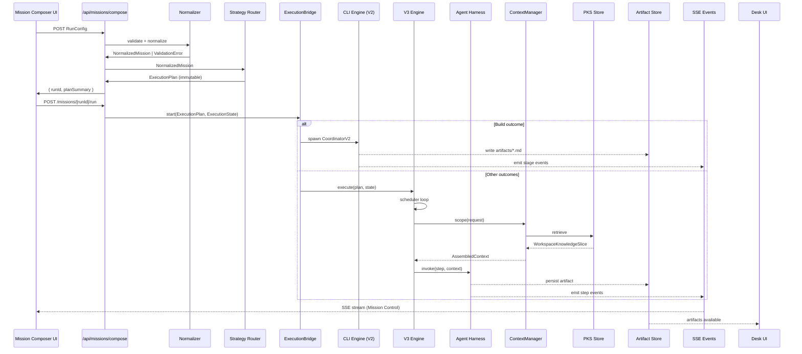

# IDEAGATE — IMPLEMENTATION SPECIFICATION
## Document 7 of 7 | Version 1.2 — Engineering Contract
## Status: Implementation Specification — Freeze Candidate

**Upstream contracts consumed (do not redefine):**
- Document 1 — Mission Composer V1 Product Spec (FROZEN)
- Document 2 — Strategy Router + ExecutionPlan Spec V1.1 (FROZEN)
- Document 3 — Orchestration Engine + Agent Harness (FROZEN)
- Document 4 — PKS v1.2 Hardened + Part 34A (FROZEN)
- Document 5 — Outcome Engineering Contracts V1.3 (FROZEN)
- Document 6 — Mission Composer UX & Experience Specification v1.2 (FROZEN)

**Governing principle:**
> AI explains and generates. Deterministic rules govern. This document defines HOW;
> upstream documents define WHAT. Where implementation detail is genuinely unspecified,
> a minimum seam is identified — product behavior is never silently invented.

**Implementation status vocabulary:**
- `CURRENTLY IMPLEMENTED` — working in V4.2-stable; do not break
- `REQUIRED FOR V1 BUILD` — must be built before V1 launch
- `PHASE 1` — planned, buildable with current stack
- `PHASE 2` — requires PKS Inspection API or structured outputs
- `FUTURE SEAM` — architectural slot; do not implement yet

---

# PART 1 — IMPLEMENTATION OVERVIEW

## 1.1 What Document 7 Is

Document 7 translates the frozen product and architectural contracts into an
engineer-buildable specification. It defines repository structure, module
boundaries, interfaces, data flow, persistence, API contracts, state machines,
failure handling, and the V1 build sequence.

Document 7 does NOT redefine upstream product behavior. When an upstream
contract governs a behavior, this document references it and specifies the
implementation that satisfies it.

## 1.2 Existing Architecture — Must Not Break

IdeaGate V4.2-stable is a two-codebase system that is **CURRENTLY IMPLEMENTED**
and working. Document 7 extends it rather than replacing it.

```
EXISTING SYSTEM (preserve):

User (browser)
    ↓ intent + model selection
Next.js UI (port 3000)          /Users/apple/agent-zero-data/workdir/ui-layer/
    ↓ POST /api/run → spawn
CLI Engine (Node.js)             /Users/apple/idea-gate-ui-safe/
    ↓ CoordinatorV2 → 15 stages
OpenRouter API
    ↓ LLM responses
workspace/{project}/artifacts/*.md
    ↑ polled every 4s by UI
Desk (ArtifactReader component)
```

**Protected files — never modify without exception protocol:**
| File | Location | Status |
|---|---|---|
| `coordinator-v2.js` | `idea-gate-ui-safe/src/core/` | MOST PROTECTED |
| `lifecycle-engine.js` | `idea-gate-ui-safe/src/core/` | PROTECTED |
| `journey-engine.js` | `idea-gate-ui-safe/src/core/` | PROTECTED |
| `llm.js` | `idea-gate-ui-safe/src/utils/` | PROTECTED |
| `parseContent.ts` | `ui-layer/src/lib/` | PROTECTED |
| `desk/page.tsx` | `ui-layer/src/app/desk/` | PROTECTED |

## 1.3 V3 Extension Strategy

The V3 architecture wraps and extends the V2 engine. It does NOT replace it.

```
NEW IN V3:

Mission Composer (Document 6)
    ↓ RunConfig
Request Normalizer (Document 2)
    ↓ NormalizedMission
Strategy Router (Document 2)
    ↓ ExecutionPlan
ExecutionBridge
    ├── [Build outcome] → wraps CoordinatorV2 (existing V2)
    └── [Other outcomes] → new V3 ExecutionEngine
ContextManager (Document 4)
    ↓ AssembledContext per step
Agent Harness (Document 3)
    ↓ capability invocations
PKS / Evidence Store (Document 4)
    ↓ JSONL-based knowledge store
Artifact System (Document 5)
    ↓ versioned artifacts + representations
SSE Events → Mission Control
```

---

# PART 2 — REPOSITORY AND MODULE ARCHITECTURE

## 2.1 Repository Structure

Two local directories, ONE GitHub remote (per ADR-001). Document 7 extensions
are added to the UI Layer only. The CLI Engine is extended via new bridge modules
that call existing protected functions without modifying them.

```
UI LAYER:  /Users/apple/agent-zero-data/workdir/ui-layer/
├── src/
│   ├── app/
│   │   ├── api/
│   │   │   ├── run/route.ts                    ← CURRENTLY IMPLEMENTED (Build)
│   │   │   ├── improve/route.ts                ← CURRENTLY IMPLEMENTED
│   │   │   ├── missions/
│   │   │   │   ├── compose/route.ts            ← REQUIRED FOR V1 BUILD
│   │   │   │   ├── [runId]/
│   │   │   │   │   ├── run/route.ts            ← REQUIRED FOR V1 BUILD
│   │   │   │   │   ├── events/route.ts         ← REQUIRED FOR V1 BUILD (SSE)
│   │   │   │   │   ├── cancel/route.ts         ← REQUIRED FOR V1 BUILD
│   │   │   │   │   └── status/route.ts         ← REQUIRED FOR V1 BUILD
│   │   │   ├── runs/[runId]/
│   │   │   │   └── artifacts/[artifactId]/route.ts  ← REQUIRED FOR V1 BUILD
│   │   │   ├── uploads/route.ts                ← REQUIRED FOR V1 BUILD
│   │   │   └── projects/[projectId]/
│   │   │       └── knowledge/route.ts          ← PHASE 2
│   │   ├── desk/page.tsx                       ← CURRENTLY IMPLEMENTED (protected)
│   │   ├── studio/page.tsx                     ← CURRENTLY IMPLEMENTED
│   │   ├── office/page.tsx                     ← CURRENTLY IMPLEMENTED
│   │   └── composer/page.tsx                   ← REQUIRED FOR V1 BUILD
│   ├── lib/
│   │   ├── parseContent.ts                     ← CURRENTLY IMPLEMENTED (protected)
│   │   ├── normalizer.ts                       ← REQUIRED FOR V1 BUILD
│   │   ├── router/
│   │   │   ├── strategy-router.ts              ← REQUIRED FOR V1 BUILD
│   │   │   ├── execution-plan-compiler.ts      ← REQUIRED FOR V1 BUILD
│   │   │   └── capability-selector.ts          ← REQUIRED FOR V1 BUILD
│   │   ├── engine/
│   │   │   ├── execution-bridge.ts             ← REQUIRED FOR V1 BUILD
│   │   │   ├── v3-execution-engine.ts          ← REQUIRED FOR V1 BUILD
│   │   │   ├── agent-harness.ts                ← REQUIRED FOR V1 BUILD
│   │   │   ├── scheduler.ts                    ← REQUIRED FOR V1 BUILD
│   │   │   └── evaluator.ts                    ← REQUIRED FOR V1 BUILD
│   │   ├── pks/
│   │   │   ├── context-manager.ts              ← REQUIRED FOR V1 BUILD
│   │   │   ├── knowledge-store.ts              ← REQUIRED FOR V1 BUILD
│   │   │   ├── evidence-store.ts               ← REQUIRED FOR V1 BUILD
│   │   │   ├── promotion-engine.ts             ← REQUIRED FOR V1 BUILD
│   │   │   ├── retrieval-pipeline.ts           ← REQUIRED FOR V1 BUILD
│   │   │   └── inspection-api.ts               ← PHASE 2
│   │   ├── artifacts/
│   │   │   ├── artifact-store.ts               ← REQUIRED FOR V1 BUILD
│   │   │   ├── representation-engine.ts        ← PHASE 1
│   │   │   └── validation-log.ts               ← PHASE 1
│   │   ├── attachments/
│   │   │   └── attachment-ingestion.ts         ← REQUIRED FOR V1 BUILD
│   │   └── workspace/
│   │       ├── workspace-manager.ts            ← REQUIRED FOR V1 BUILD
│   │       └── stale-propagation.ts            ← PHASE 1

CLI ENGINE:  /Users/apple/idea-gate-ui-safe/
├── src/
│   ├── core/
│   │   ├── coordinator-v2.js                   ← PROTECTED — do not modify
│   │   ├── lifecycle-engine.js                 ← PROTECTED — do not modify
│   │   └── journey-engine.js                   ← PROTECTED — do not modify
│   └── utils/
│       └── llm.js                              ← PROTECTED — do not modify
```

## 2.2 Module Boundary Rules

1. **Client components may never access the filesystem.** Components marked `'use client'` must never import `fs`, `path`, `os`, or any server-only module (workspace-manager, artifactStore, PKS modules). Violations cause Next.js build errors and runtime failures. **Server-side lib modules legitimately own storage operations** — `lib/pks/`, `lib/artifacts/`, `lib/workspace/` are server-only service layers. API routes call these services; they do not duplicate their logic.
2. **The App Router remains intact.** No pages-based routing introduced.
3. **No circular dependencies between lib modules.** The dependency direction is:
   `api routes → lib/engine → lib/pks → lib/workspace`
4. **PKS modules are server-only.** They must never be imported in client components.
5. **ContextManager is a boundary wall.** Nothing outside `lib/pks/` reads PKS files directly.

---

# PART 3 — DATA FLOW SPECIFICATION

## 3.1 Canonical Request Flow



## 3.2 Workspace Storage Layout (V3)

All file operations are relative to the workspace root configured via environment:
`WORKSPACE_ROOT` (default: `workspace/` in UI Layer root).

```
{WORKSPACE_ROOT}/
  {projectId}/
    knowledge/
      items.jsonl              ← WorkspaceKnowledgeItems (append-only)
      evidence.jsonl           ← project-scoped EvidenceItems
      artifact-index.jsonl     ← ArtifactKnowledgeEntries
      artifact-impact.jsonl    ← ArtifactImpactRecords
      implications.jsonl       ← Implication records
      contradictions.jsonl     ← ContradictionRecords
      supersessions.jsonl      ← SupersessionRecords
      annotations.jsonl        ← PKSAnnotations (human-layer)
    runs/
      {runId}/
        // ARCHITECTURAL DECISION (D7 v1.2 Cross-Document Audit — L2):
        // D2 §1.4 declared workspace/{projectId}/artifacts/{artifactId}.md as canonical.
        // D3 §18.3 crash recovery used ${plan.missionId}/artifacts/${artifactId}.md.
        // D7 uses workspace/{projectId}/runs/{runId}/artifacts/{artifactId}/v{N}.md (versioned).
        // Resolution: D7's versioned path is adopted as the new canonical (architecturally superior:
        // versioning, provenance, run-scoping). D2 §1.4 and D3 §18.3 require amendment.
        // The D3 crash-recovery path must be updated to:
        //   ${WORKSPACE_ROOT}/${plan.projectId}/runs/${plan.runId}/artifacts/${artifactId}/v1.md
        plan.json              ← ExecutionPlan (immutable — written once at plan compile; never overwritten)
        routing-decision.json  ← Router's compiled routing rationale (Mission Control §17.4: "What did IdeaGate decide to do?")
        normalized-mission.json ← Complete NormalizedMission output from Normalizer (D2 §1.4 canonical file)
                                   written by /api/missions/compose; read by ExecutionBridge for intent/outcome/depth
                                   NOTE: replaces 'execution-meta.json' (D7 v1.1 invention). D2 authoritative name used.
        state.json             ← ExecutionState (rename-atomic writes with in-process write lock — Document 3 §3.3)
        events.jsonl           ← SSE event log (append-only; in-process append mutex — Document 3 §16.4)
        evaluations.jsonl      ← EvaluationLogEntries (append-only; Document 3 §16.1)
        evidence.jsonl         ← run-scoped EvidenceItems
        context-trace.jsonl    ← ContextAssemblyTrace per step
        outcome-digest.json    ← RunOutcomeDigest (written on completion)
        artifacts/
          {artifactId}/
            v{N}.md            ← narrative layer (Markdown)
            v{N}-meta.json     ← artifact metadata + provenance
            v{N}-structured.json  ← structured data layer (Phase 2)
        attachments/
          {attachmentId}       ← ingested file content
          {attachmentId}.meta.json  ← provenance + extraction metadata
    projects.json              ← project registry (existing V2 file)
```

**Atomic write rule:** All writes to `state.json` must be atomic:
```typescript
// Write to .tmp, then rename — avoids partial state corruption on crash
const tmpPath = statePath + '.tmp';
fs.writeFileSync(tmpPath, JSON.stringify(state, null, 2));
fs.renameSync(tmpPath, statePath);
```

---

# PART 4 — REQUEST NORMALIZATION

## 4.1 Responsibility

**Source:** Document 2 §3.1 (Normalizer contract)
**Location:** `src/lib/normalizer.ts`
**Status:** `REQUIRED FOR V1 BUILD`

Validates the raw RunConfig, applies defaults, checks incompatible combinations,
and produces a NormalizedMission. Never calls the Strategy Router or Engine.

## 4.2 Interface

```typescript
// src/lib/normalizer.ts

export interface RunConfig {
  intent: string;
  outcome: OutcomeId;
  depth?: DepthLevel;
  // orchestrationOverride — authoritative type from D1/D2: OrchestrationRecipeId
  // D2 §2.4 validates: 'debate' (Decide only) and 'goal-based-research-loop' (requires goal).
  // V1 Composer only exposes 'debate' override (D6 §10.2), but the Normalizer must
  // validate all cases per D2 §2.4. Do NOT narrow to literal 'debate' only.
  orchestrationOverride?: OrchestrationRecipeId;
  context?: {
    uploadedDocuments?: string[];    // attachment IDs from /api/uploads
    urls?: string[];
    artifactIds?: string[];          // prior IdeaGate artifact IDs
    includeWorkspaceMemory?: boolean;
  };
  goal?: ValidatedGoalSpec;
  // V1 Goal handling (Document 2 GoalSpec seam):
  // - The `goal` field IS accepted in RunConfig and IS consumed by the Strategy Router
  //   in V1: `getRecipeForOutcome()` selects 'goal-based-research-loop' when `goal` is present
  //   on a research outcome (see Part 5.2).
  // - The loop execution engine (Document 3 §12) is Phase 1. In V1, if `goal` triggers
  //   'goal-based-research-loop', the execution runs a single research iteration without
  //   looping (the loop policy is present in the plan but maxIterations = 1 at Phase 1).
  // - "Currently ignored" was incorrect. The correct V1 statement: goal drives recipe
  //   selection; loop iteration is Phase 1 and executes only once in V1.
  // - GoalSpec itself is not exposed in the V1 Composer UI (Document 6 §10.1a).
  projectId: string;
}

// NormalizedMission — authoritative contract per Document 2 §2.7
// D7 NOTE: 'missionId' and 'runId' are DISTINCT concepts in D2:
//   missionId = UUID stable across this mission's lifetime (from D2 §2.7)
//   runId     = specific execution run (from D2 §14 ExecutionState)
// D7 v1.1 incorrectly used 'runId' where D2 uses 'missionId'. Corrected in v1.2.
export interface NormalizedMission {
  missionId: string;                 // UUID — stable across this mission's lifetime (D2 §2.7)
  runId: string;                     // execution run ID (may differ from missionId in future)
  projectId: string;                 // implementation field; not in D2 but required for V1 persistence

  // From RunConfig, validated (D2 §2.7)
  intent: string;
  outcome: OutcomeId;
  depth: DepthLevel;                 // always set; defaults to 'balanced' (D2 §2.6)
  orchestrationOverride?: OrchestrationRecipeId;
  context: ResolvedContextBundle;    // D2 §2.7 full contract type
  goal?: ValidatedGoalSpec;

  // Added by the Normalizer (D2 §2.7)
  inferredOutcome: boolean;          // true if outcome was inferred; false if explicitly selected
  inferenceConfidence?: number;      // 0–1; present when inferredOutcome=true (Phase 2+)
  appliedDefaults: AppliedDefault[]; // record of every default that was applied
  appliedNormalizations: AppliedNormalization[]; // record of every normalization applied
  normalizationVersion: string;      // 'v1' — enables future migration
  normalizedAt: string;              // ISO 8601
}

// V1 implementations of AppliedDefault and AppliedNormalization
// These are minimal; expand per D2 §2.6 as needed
interface AppliedDefault {
  field: string;     // e.g., 'depth'
  value: unknown;    // the defaulted value
}
interface AppliedNormalization {
  field: string;
  from: unknown;
  to: unknown;
  reason: string;
}

// ResolvedContextBundle — authoritative type per D2 §2.7
interface ResolvedContextBundle {
  uploads: ValidatedContextItem[];
  urls: ValidatedUrl[];
  artifactIds: string[];              // D7: renamed from workspaceArtifactPaths for clarity
  includeWorkspaceMemory: boolean;    // defaults to false (D2 §2.6)
  estimatedContextTokens: number;     // rough upper bound for budget planning
}

export type NormalizerResult =
  | { ok: true; mission: NormalizedMission }
  | { ok: false; errors: NormalizerError[] };

export interface NormalizerError {
  code: NormalizerErrorCode;
  field?: string;
  message: string;   // PM-native; shown in Composer UI
}

export type NormalizerErrorCode =
  | 'INTENT_REQUIRED'
  | 'INTENT_TOO_SHORT'
  | 'OUTCOME_REQUIRED'
  | 'INVALID_OUTCOME'
  | 'OUTCOME_REQUIRES_CONTEXT'     // Document 2 §7: review + investigate
  | 'ORCHESTRATION_INCOMPATIBLE'   // debate not valid for all outcomes
  | 'INVALID_DEPTH'
  | 'PROJECT_NOT_FOUND';

export async function normalizeRunConfig(
  raw: RunConfig
): Promise<NormalizerResult> {
  const errors: NormalizerError[] = [];

  // 1. Intent validation
  if (!raw.intent?.trim()) {
    errors.push({ code: 'INTENT_REQUIRED', field: 'intent', message: 'Describe what you want to accomplish.' });
  // D2 §2.2 authoritative threshold: ≥ 10 characters (D7 v1.1 used < 3 words — corrected in v1.2)
  } else if (raw.intent.trim().length < 10) {
    errors.push({ code: 'INTENT_TOO_SHORT', field: 'intent', message: 'Add more detail — a sentence or two is enough.' });
  }

  // 2. Outcome validation
  if (!raw.outcome) {
    errors.push({ code: 'OUTCOME_REQUIRED', field: 'outcome', message: 'Choose a mission type.' });
  } else if (!CANONICAL_OUTCOME_IDS.includes(raw.outcome)) {
    errors.push({ code: 'INVALID_OUTCOME', field: 'outcome', message: `Unknown outcome: ${raw.outcome}` });
  }

  // 3. Context requirements for Review and Investigate (Document 2 §7)
  if (raw.outcome === 'review' || raw.outcome === 'investigate') {
    const hasContext = (raw.context?.uploadedDocuments?.length ?? 0) > 0
                    || (raw.context?.artifactIds?.length ?? 0) > 0
                    || (raw.context?.urls?.length ?? 0) > 0;
    if (!hasContext) {
      const message = raw.outcome === 'review'
        ? 'Review requires an artifact to review. Upload a document or select one from your workspace.'
        : 'Investigation requires evidence. Upload data, research, or a product spec before running.';
      errors.push({ code: 'OUTCOME_REQUIRES_CONTEXT', field: 'context', message });
    }
  }

  // 4. Orchestration compatibility (Document 2 §2.4)
  if (raw.orchestrationOverride === 'debate' && raw.outcome !== 'decide') {
    errors.push({
      code: 'ORCHESTRATION_INCOMPATIBLE', field: 'orchestrationOverride',
      message: 'Debate requires two competing positions. This mission type uses a different approach.'
    });
  }
  // D2 §2.4: 'goal-based-research-loop' override requires an explicit goal
  if (raw.orchestrationOverride === 'goal-based-research-loop' && !raw.goal) {
    errors.push({
      code: 'ORCHESTRATION_INCOMPATIBLE', field: 'orchestrationOverride',
      message: 'Goal-based loop requires an explicit goal specification.'
    });
  }
  // D2 §2.4: 'debate' on casestudy is also incompatible
  if (raw.orchestrationOverride === 'debate' && raw.outcome === 'casestudy') {
    errors.push({
      code: 'ORCHESTRATION_INCOMPATIBLE', field: 'orchestrationOverride',
      message: 'Debate is not compatible with Case Study — narrative authorship requires a single voice.'
    });
  }

  if (errors.length > 0) return { ok: false, errors };

  // 5. Apply defaults (Document 2 §3.1)
  const mission: NormalizedMission = {
    runId: crypto.randomUUID(),
    projectId: raw.projectId,
    intent: raw.intent.trim(),
    outcome: raw.outcome,
    depth: raw.depth ?? 'balanced',                          // Document 2 default
    orchestrationOverride: raw.orchestrationOverride,
    context: {
      uploadedDocuments: raw.context?.uploadedDocuments ?? [],
      urls: raw.context?.urls ?? [],
      artifactIds: raw.context?.artifactIds ?? [],
      includeWorkspaceMemory: raw.context?.includeWorkspaceMemory ?? false,  // Document 2 default
    },
    normalizedAt: new Date().toISOString(),
  };

  return { ok: true, mission };
}

const CANONICAL_OUTCOME_IDS: OutcomeId[] = [
  'build', 'research', 'review', 'decide', 'council',
  'investigate', 'prioritize', 'plan', 'casestudy'
];
```

## 4.3 Failure Modes

| Failure | Behavior |
|---|---|
| Intent too short | `INTENT_TOO_SHORT` returned; Composer shows PM-native message |
| Outcome not set | `OUTCOME_REQUIRED` returned |
| Review/Investigate without context | `OUTCOME_REQUIRES_CONTEXT`; Composer shows blocked state |
| Debate on non-Decide outcome | `ORCHESTRATION_INCOMPATIBLE` |
| Project not found | `PROJECT_NOT_FOUND`; Composer error state |

---

# PART 5 — STRATEGY ROUTER IMPLEMENTATION

## 5.1 Responsibility

**Source:** Document 2 (complete chapter)
**Location:** `src/lib/router/strategy-router.ts`
**Status:** `REQUIRED FOR V1 BUILD`

Consumes the NormalizedMission and compiles an immutable ExecutionPlan. The Router
must NOT be called again once the plan is compiled; the plan governs execution.

## 5.2 Five-Layer Capability Selection

```typescript
// src/lib/router/capability-selector.ts

export function selectCapabilities(mission: NormalizedMission): CapabilityId[] {
  // Layer 1: Domain capabilities from artifact contract
  const domainCapabilities = getDomainCapabilities(mission.outcome);

  // Layer 2: Context signals (document type, symptom signals)
  const contextSignals = analyzeContextSignals(mission.context);
  const contextCapabilities = getContextCapabilities(contextSignals, mission.outcome);

  // Layer 3: Depth/evaluation additions
  const depthCapabilities = getDepthCapabilities(mission.depth, mission.outcome);

  // Layer 4: Orchestration (CO when recipe requires synthesis/stage-gate)
  const needsCO = recipeRequiresCO(getRecipeForOutcome(mission));
  const orchestrationCapabilities: CapabilityId[] = needsCO ? ['CO'] : [];

  // Layer 5: Delegation (sub-agents for eligible outcomes at deep/exhaustive)
  // Sub-agents are not separate CapabilityIds; they are handled by the parent capability
  // delegation policy in the AgentHarness.

  const all = new Set([
    ...domainCapabilities,
    ...contextCapabilities,
    ...depthCapabilities,
    ...orchestrationCapabilities,
  ]);

  return Array.from(all);
}

// Document 2 §4 DOMAIN_CAPABILITY_MAP
function getDomainCapabilities(outcome: OutcomeId): CapabilityId[] {
  const map: Record<OutcomeId, CapabilityId[]> = {
    build:      ['RE', 'PS', 'UX', 'AR', 'QA'],  // CO added via Layer 4
    casestudy:  ['RE', 'PS'],
    research:   ['RE', 'PS', 'QA'],               // CO added via Layer 4
    review:     [],                                // context-driven — see Layer 2
    decide:     ['PS'],                           // CO added via Layer 4
    council:    [],                               // context-driven — see Layer 2
    investigate:['RE', 'QA', 'PS'],               // CO added via Layer 4; ±UX/AR via Layer 2
    prioritize: ['PS', 'QA'],
    plan:       ['AR', 'PS', 'QA'],
  };
  return map[outcome] ?? [];
}

// Document 2 §6: recipe → CO requirement
function recipeRequiresCO(recipe: RecipeId): boolean {
  const CO_RECIPES: RecipeId[] = [
    'structured-delivery',  // Build — with stage-gate CO coordination (not a separate RecipeId)
    'research-first',
    'parallel-critique',
    'red-blue-debate',
    'council',
    'goal-based-research-loop',
  ];
  return CO_RECIPES.includes(recipe);
}

export function getRecipeForOutcome(mission: NormalizedMission): RecipeId {
  if (mission.orchestrationOverride === 'debate') return 'red-blue-debate';
  const recipeMap: Record<OutcomeId, RecipeId> = {
    // L1 RESOLVED (Cross-Document Audit): Decide defaults to structured-delivery.
    // red-blue-debate requires orchestrationOverride: 'debate' (explicit opt-in).
    // Authority: D5 §18, D6 §10.2 (freeze candidate), D2 §7.2 (amended interpretation).
    build:      'structured-delivery',      // D2: structured-delivery with stage-gate CO
    casestudy:  'structured-delivery',
    research:   mission.goal ? 'goal-based-research-loop' : 'research-first',
    review:     'parallel-critique',
    // ARCHITECTURAL DECISION (D7 v1.2 Cross-Document Audit):
    // D2 §7.2 routing summary listed Decide → red-blue-debate, but D5 §18 and D6 §10.2
    // (the approved UX freeze candidate) both require explicit orchestrationOverride: 'debate'
    // to activate red-blue-debate. The D2 table described the debate path, not the default.
    // Resolution: Decide defaults to structured-delivery; debate is an explicit opt-in.
    // D2 §7.2 auto-selection text requires amendment to reflect this.
    decide:     'structured-delivery',
    council:    'council',
    investigate:'research-first',
    prioritize: 'structured-delivery',
    plan:       'structured-delivery',
  };
  return recipeMap[mission.outcome];
}
```

## 5.3 ExecutionPlan Schema

```typescript
// src/lib/router/execution-plan-compiler.ts

export interface ExecutionPlan {
  planId: string;
  runId: string;
  projectId: string;
  outcome: OutcomeId;
  recipe: RecipeId;
  depth: DepthLevel;
  orchestrationOverride?: 'debate';

  // capabilityInstances — INTERNAL COMPILATION STRUCTURE
  // This field is produced by the Strategy Router's capability selector when
  // compiling the plan. It is an implementation record of which capability
  // instances were selected (including instanceRole for debate/council) and
  // is consumed by the Agent Harness to resolve prompt templates and tool sets.
  //
  // IMPORTANT: capabilityInstances is NOT an alternative or competing
  // ExecutionPlan schema. Document 2 is the single authoritative ExecutionPlan
  // contract. This field implements the Document 2 capability list within the
  // plan structure. It does not add new semantics; it does not replace
  // Document 2's concept of capabilities; it must never be treated as defining
  // what capabilities mean or how they are selected.
  capabilityInstances: CapabilityInstance[];

  // Ordered steps with isolation rules
  steps: ExecutionStep[];

  // Context assembly rules (Document 4 §9)
  contextPlan: ContextPlan;

  // Failure handling (Document 3 §15)
  failurePlan: FailurePlan;

  // Evaluation policy (Document 2 §10, Document 5)
  evaluationPolicy: EvaluationPolicy;

  // artifactContract — INTERNAL COMPILATION STRUCTURE (derived from Document 5 ArtifactContract)
  // This field is compiled from the authoritative artifact contracts in Document 5
  // (per-outcome artifact specs). It is an implementation record used by the Engine
  // to know which artifacts are expected, which steps produce them, and whether a
  // Validation Log is required.
  //
  // IMPORTANT: CompiledArtifactContract is NOT a replacement for the Document 5
  // ArtifactContract semantics. It is a compiled internal structure that implements
  // those semantics. The Engine accesses plan.artifactContract.artifacts[] for all
  // artifact lookups (Document 3 §4.5, §15.2). It does not add new artifact types.
  artifactContract: CompiledArtifactContract;

  // Plan identity and version (Document 3 §7.1)
  // Plan identity (Document 3 §18.3 uses plan.missionId in artifact paths)
  missionId: string;            // = projectId (V1: project and mission are 1:1; V2+ may differ)
  schemaVersion: string;        // plan schema version; engine rejects if unsupported (ENG_08)
  planVersion: number;          // monotonic plan version; distinct from schemaVersion
  routingDecisionId: string;    // ID of the routing decision that produced this plan
                                // (correlates with routing-decision.json for observability)

  // Capabilities (Document 2 §6 authoritative list; capabilityInstances is internal compilation)
  // This list mirrors the Document 2 capability set selected by the Router.
  capabilities: CapabilityId[];     // ordered set of selected capabilities for this mission

  // Delegation policy (Document 3 §11)
  delegationPolicy: DelegationPolicy;

  // Loop policy (Document 2 §13; absent if outcome is not loop-eligible)
  loopPolicy?: LoopPolicy;

  // Hard budget (Document 3 §14; Engine enforces before each dispatch)
  hardBudget: HardBudget;

  // Observability (Document 3 §20; controls what events the Engine emits)
  observabilityConfig: ObservabilityConfig;

  // Routing rationale (for debugging and audit; not consumed by Engine)
  routingRationale?: {
    layer1Domains: CapabilityId[];
    layer2ContextSignals: string[];
    layer3DepthAdditions: CapabilityId[];
    layer4CoRequired: boolean;
    layer5DelegationEligible: boolean;
  };

  // V2 compatibility (Document 3 §19.1)
  // Present only for Build outcome. Maps V3 step IDs to V2 coordinator stage indices.
  // The Engine uses this to delegate to the V2 executor for the appropriate stage.
  internalStageMappings?: InternalStageMapping[];

  compiledAt: string;
  // IMMUTABLE after compilation — never mutate post-creation
}

// Supporting types for restored ExecutionPlan fields

// InternalStageMapping — Document 3 §19.1 V2 compatibility
export interface InternalStageMapping {
  stepId: string;          // V3 ExecutionStep.stepId
  v2StageIndex: number;    // 0–14 for Build's V2 coordinator stages
  v2StageName: string;     // human-readable stage name (for debugging)
}

export interface DelegationPolicy {
  delegationEligible: boolean;      // true for research/investigate/council at deep/exhaustive
  maxWorkers: number;               // 0 = no sub-agents; Document 3 §11
  workerDepthConstraint: 'same' | 'one-less'; // workers run at depth ≤ parent
  workersMayNotSpawnWorkers: true;  // invariant: no sub-sub-agents
}

export interface LoopPolicy {
  maxIterations: number;
  maxTotalCostUsd: number;
  improvementThreshold?: number;    // score delta below which loop terminates
  goalSpec?: ValidatedGoalSpec;     // from RunConfig.goal (Phase 1; see §4.5)
}

// HardBudget — authoritative schema per Document 3 §14 + Document 2 HardBudget
// The Engine enforces ALL four dimensions before every dispatch.
export interface HardBudget {
  // Cost ceiling (Document 3 §14, §1497)
  costCeilingUsd: number;
  onCostExhausted: 'stop-immediately';      // Document 3 §14.2: immediate stop; in-flight NOT waited for

  // Duration ceiling (Document 3 §14, §1501)
  maxDurationMs: number;
  onDurationExhausted: 'complete-current-then-stop'; // Document 3 §14.2: drain in-flight then stop

  // Step count ceiling (Document 3 §14, §1509)
  maxTotalSteps: number;
  onStepCountExhausted: 'stop-immediately';

  // Concurrency ceiling (Document 3 §4.3, §388)
  maxConcurrentSteps: number;  // Scheduler will not dispatch beyond this; checked pre-dispatch

  // Budget warning threshold (Document 3 §2052, integration test 16)
  // Engine emits 'budget_warning' event when consumedActualCostUsd >= warningThresholdFraction * costCeilingUsd
  warningThresholdFraction: number;  // default: 0.80
}

// ObservabilityConfig — derived from Document 3 §17.1 requirements
// Every event MUST carry: PM-native activityText, runId, planId, timestamp.
// Events are written to events.jsonl and forwarded to SSE subscribers.
export interface ObservabilityConfig {
  // PM-native events always emitted — this cannot be turned off (Document 3 §17.1)
  // They are the primary communication channel to Mission Control.
  emitPMEvents: true;

  // Internal diagnostic events (internal: true) are written to events.jsonl but NOT
  // forwarded to SSE subscribers. They enable replay, debugging, and crash recovery
  // inspection without exposing engineering internals to the PM view.
  emitInternalDiagnostics: boolean;

  // Budget warning threshold (fraction of cost ceiling; Document 3 integration test #16)
  // When consumedActualCostUsd >= costCeilingUsd * budgetWarningThreshold:
  // emit 'budget_warning' event. Defaults to 0.80 if not specified.
  budgetWarningThreshold?: number;
}

export interface CapabilityInstance {
  instanceId: string;        // unique within this plan
  capabilityId: CapabilityId;
  role?: string;             // 'blue' | 'red' | 'judge' | null
}

export interface ExecutionStep {
  stepId: string;
  // stepType — authoritative vocabulary from Document 3 §14 STEP_TIMEOUT_BY_TYPE
  // 'generate'  : capability produces a narrative or structured artifact
  // 'evaluate'  : capability assesses a prior generate step's output against quality criteria
  // 'synthesize': capability combines multiple prior outputs into a unified result (council, debate judge receives outputs)
  // 'judge'     : capability adjudicates between competing positions (debate: CO[judge] receives blue + red)
  // 'aggregate' : capability aggregates assessor outputs (council: CO receives all assessors)
  // 'delegate'  : plan step that spawns sub-agent workers and merges their SubAgentResults
  //
  // NOTE: 'validate' and 'loop-check' (prior D7 v1.1 values) do NOT exist in Document 3.
  // 'validate' was a misname — the authoritative evaluate step type covers this.
  // 'loop-check' does not exist — loop termination is handled by the Engine's termination
  // condition check in the scheduler loop, not by a dedicated step type.
  // Document 3 Invariant 25: stepType = WHAT; capabilityInstanceId = WHO.
  stepType: 'generate' | 'evaluate' | 'synthesize' | 'judge' | 'aggregate' | 'delegate';
  order: number;                    // dispatch order (Document 3 §4.4); same-order steps dispatched concurrently

  // Capability references (resolved from capabilityInstances at compile time)
  capabilityInstanceId: string;     // references CapabilityInstance.instanceId in this plan
  capabilityId: CapabilityId;       // denormalised for harness resolution without plan lookup
  instanceRole?: string;            // 'blue' | 'red' | 'judge' | null — debate/council only

  // Artifact identity
  artifactId?: string;              // artifact produced/evaluated by this step
  outputArtifactIds?: string[];     // all artifact IDs written by this step (>1 for multi-artifact steps)
  revisesStepId?: string;           // for revision attempts: the generate step being revised

  // Dependency and isolation (Document 3 §4.2, §6)
  dependsOn: string[];              // scheduling gate: all must be in completedStepIds before dispatch
  receivesOutputFrom: string[];     // context scoping: outputs from these steps may enter context
  mustNotReceiveOutputFrom: string[]; // isolation enforcement: outputs from these must NOT enter context

  // Evaluate-step specific
  evaluatesStepId?: string;
  // Present on 'evaluate' steps (Document 3 §9.1, §9.4).
  // Identifies the 'generate' step whose output this evaluation assesses.
  // For solo evaluation (§9.4): may point to an artifact from a prior run or uploaded doc.
  // Transition behavior (pass/fail) is governed by EvaluationPolicy.failureBehavior,
  // not by per-step enum. The Engine reads EvaluationPolicy to determine next action.

  // Execution specification
  taskSpec: TaskSpec;
  allowedTools: ToolId[];           // tools this step may invoke (Document 3 §7.3)

  // Build-specific (V2 bridge only)
  internalStageIndex?: number;      // 0–14 for Build/V2; absent for V3 steps
}

// TaskSpec — authoritative contract per Document 3 §7.1, §9.2
//
// TaskSpec describes WHAT a step must accomplish and WHAT output it must produce.
// It is NOT a prompt template. The Agent Harness builds the final prompt from:
//   (a) the capability's base system prompt (HarnessInvocation.systemPromptBase)
//   (b) TaskSpec.objective — what this particular step must do
//   (c) TaskSpec.framing   — any additional task-level framing
//   (d) AssembledContext   — the retrieved knowledge/evidence
//
// Document 3 §7.2: HarnessInvocation carries systemPromptBase and instanceFraming
// as SEPARATE fields (not inside TaskSpec). TaskSpec contains the task-specific
// semantic contract, not the capability-level prompt.
// TaskSpec — authoritative contract per D1 §29, D2 §12 (with D5 §5.2 addition)
//
// D1 and D2 define the authoritative fields. D5 §5.2 adds extractionHints as a
// legitimate downstream addition (requires a corresponding D2 amendment to be formal).
// 'outputSchema' was renamed to 'outputSchemaId' (string ID reference vs inline schema).
// 'framing' was required in D2 but optional here for V1 compatibility — see note below.
export interface TaskSpec {
  // D2 §12 required: what this step must accomplish
  objective: string;

  // D2 §12 required: additional capability-specific framing for this task
  // Note: D2 makes this required; D7 makes it optional for V1 step generation flexibility.
  // TODO: tighten to required once all V1 steps have explicit framing.
  framing?: string;

  // D2 §12: outputSchema renamed to outputSchemaId (string ID → schema registry lookup)
  // Required for 'evaluate' steps (structured score return is mandatory for deterministic eval).
  // Optional for 'generate' steps in V1; required in Phase 2 for PKS extraction.
  // Implementation: src/lib/engine/schema-registry.ts resolves ID to schema.
  outputSchemaId: OutputSchemaId;   // required — D2 authoritative: OutputSchemaId not just string

  // D2 §12 required: quality dimensions the evaluator must score on this step
  // Present on ALL generate steps. Defines what 'good output' means for this specific step.
  // Used by the paired evaluate step to populate EvaluationLogEntry.dimensionScores.
  qualityDimensions: QualityDimension[];

  // D2 §12: evidence requirement level for this step
  evidenceRequirementLevel: EvidenceRequirementLevel;  // 'required' | 'preferred' | 'optional'

  // D5 §5.2 addition (D2 amendment needed): which PKS knowledge fields to populate
  extractionHints?: ExtractionHint[];
}

// Supporting types (implementations — full definitions in schema-registry.ts)
type OutputSchemaId = string;         // e.g. 'evaluation-result-v1', 'research-finding-v1'
type QualityDimension = string;       // e.g. 'completeness', 'evidence-quality', 'rationale-clarity'
type EvidenceRequirementLevel = 'required' | 'preferred' | 'optional';
// NOTE: The previous fields 'systemPromptTemplate' and 'userPromptTemplate' were
// implementation-level prompt plumbing that did not belong in the architectural TaskSpec.
// They were removed in this pass. The Harness builds the final prompt from
// HarnessInvocation.systemPromptBase + taskSpec.objective + taskSpec.framing + context.
// The schema registry (outputSchemaId) replaces the earlier structuredOutputSchema object.

export interface ContextPlan {
  capabilityContextIds: Record<string, string[]>;  // instanceId → explicit context item IDs
  includeWorkspaceMemory: boolean;
  uploadedDocuments: string[];
  urls: string[];
}

// EvaluationPolicy — authoritative contract per Document 3 §9, Document 2 §10
export interface EvaluationPolicy {
  // Scoring
  dimensions: EvaluationDimension[];
  passThreshold: number;           // Document 3 §5.1: 'score >= threshold'; was 'threshold'
  requiredDimensions: string[];    // these must pass individually even if overall score meets threshold

  // Revision
  maxRevisions: number;            // maximum quality revision attempts; 0 = no revisions
  failureBehavior: 'revise-then-fail' | 'advance-with-warning';
  // Document 3 §9.2 / §1052: onRevisionExhausted derives from failureBehavior
  // 'revise-then-fail'     → step fails, dependency cascade applied
  // 'advance-with-warning' → artifact accepted with quality warning flag

  // Evaluator identity (Document 3 §9.5: evaluatorCapabilityId in EvaluationLogEntry)
  // The compiled plan declares which capability evaluates which steps.
  // Typically QA evaluates generate steps; CO evaluates debate/council.
  evaluatorCapabilityId: CapabilityId;

  // Outcome-specific constraints
  minimumHypotheses?: number;      // investigate outcome: 3 per Document 2 §15
}

// CompiledArtifactContract — authoritative Document 3 structure (§4.5, §15.2)
// Compiled by the Strategy Router from Document 5 per-outcome artifact specs.
// The Engine accesses .artifacts[] — never treats this as a flat array.
export interface CompiledArtifactContract {
  artifacts: ArtifactSpec[];  // all artifacts expected from this plan
}

export interface ArtifactSpec {
  id: string;                  // stable artifact identifier
  title: string;               // PM-facing name (e.g., "Evidence Summary")
  required: boolean;           // true = must be produced; failure to produce fails the run
  producingStepId: string;     // which ExecutionStep.stepId produces this artifact
  requiredLayer: 'narrative' | 'structured' | 'both';
  validationLogRequired: boolean;  // claim-driven per Document 5 §4.3
  // Note: ArtifactSpec is the compiled internal representation of the Document 5
  // per-outcome artifact contract. It does not create new artifact types.
}
```

---

# PART 6 — EXECUTION BRIDGE

## 6.1 Responsibility

**Source:** Document 3 (runtime semantics)
**Location:** `src/lib/engine/execution-bridge.ts`
**Status:** `REQUIRED FOR V1 BUILD`

Routes mission execution to either the existing V2 CLI engine (Build outcome) or
the new V3 execution engine (all other outcomes). Adapts output formats between
the two systems without modifying protected files.

## 6.2 Interface

```typescript
export async function startExecution(
  plan: ExecutionPlan,
  state: ExecutionState,
  opts: ExecutionOptions
): Promise<void> {
  // Write the immutable plan to disk before any execution
  await writePlan(plan);

  if (plan.outcome === 'build') {
    await executeViaV2Bridge(plan, state, opts);
  } else {
    await executeViaV3Engine(plan, state, opts);
  }
}

async function executeViaV2Bridge(
  plan: ExecutionPlan,
  state: ExecutionState,
  opts: ExecutionOptions
): Promise<void> {
  // ── Intent must come from normalized-mission.json, NOT from step templates ────
  // Authoritative flow: RunConfig.intent → NormalizedMission.intent →
  //   normalized-mission.json (written at /api/missions/compose) → read here
  // Reads normalized-mission.json (D2 §1.4 canonical file) — NOT execution-meta.json
  const normalizedMission = await readNormalizedMission(plan.runId, plan.projectId);
  if (!normalizedMission?.intent) {
    throw new Error(`ENG_BRIDGE_01: normalized-mission.json missing or has no intent for run ${plan.runId}`);
  }

  // ── Artifact isolation: record existing files BEFORE spawning ─────────────
  // We cannot modify coordinator-v2.js to write a manifest, so we snapshot
  // the artifact directory before starting. Only files created/modified
  // AFTER spawnStartMs are attributed to this run.
  const artifactDir = path.join(WORKSPACE_ROOT, plan.projectId, 'artifacts');
  const existingFiles = new Set(
    fs.existsSync(artifactDir) ? fs.readdirSync(artifactDir) : []
  );
  const spawnStartMs = Date.now();

  const { runProcess, cleanup } = spawnV2Engine({
    projectId: plan.projectId,
    runId: plan.runId,
    intent: normalizedMission.intent,  // ← from normalized-mission.json (D2 canonical), not from step template
    model: resolveModelForPlan(plan),
    apiKey: opts.apiKey,
  });

  // Forward V2 stdout events to SSE
  runProcess.stdout?.on('data', (chunk) => {
    const events = parseV2EventChunk(chunk.toString());
    for (const event of events) {
      emitSSEEvent(plan.runId, translateV2EventToV3(event));
    }
  });

  await runProcess;
  // Pass the pre-spawn snapshot and start time so the adapter can determine
  // which files belong to THIS run (V1 compatibility boundary — see §6.3).
  await adaptV2ArtifactsToV3Format(plan, existingFiles, spawnStartMs);
  cleanup();
}
```

## 6.3 V2 → V3 Artifact Adaptation

After V2 engine completes, the bridge reads the V2 artifact files and writes
them in V3 format. This is a **post-run one-way adaptation** that preserves
the V2 output without modifying how V2 produces it.

```typescript
async function adaptV2ArtifactsToV3Format(
  plan: ExecutionPlan,
  existingFiles: Set<string>,
  spawnStartMs: number
): Promise<void> {
  // V2 writes: workspace/{project}/artifacts/{stage}-{name}.md
  // V3 expects: workspace/{project}/runs/{runId}/artifacts/{artifactId}/v1.md

  const v2Dir = path.join(WORKSPACE_ROOT, plan.projectId, 'artifacts');
  if (!fs.existsSync(v2Dir)) return;

  const allFiles = fs.readdirSync(v2Dir).filter(f => f.endsWith('.md'));

  // ── Artifact isolation: only attribute files from THIS run ─────────────────
  // A file belongs to this run if it was NOT in existingFiles (new) OR was
  // modified after spawnStartMs (modified during this run).
  //
  // V1 COMPATIBILITY BOUNDARY — NOT PERFECT PROVENANCE:
  // This timestamp-based attribution is a pragmatic V1 boundary sufficient for
  // the single-tenant, single-run-at-a-time V1 architecture. It is not a
  // guarantee of perfect attribution: an external process writing a file at
  // the same millisecond would be incorrectly attributed, and a V2 engine
  // crash that wrote a partial file before spawnStartMs would be missed.
  //
  // Attribution constraint is acknowledged in the artifact provenance:
  // `producedByCapability: 'v2-engine'` (not a Document 3 capabilityId) and
  // `confidence: 50` (model-generated cap) reflect that this attribution is
  // bridge-inferred, not directly observed from a V3 Engine step result.
  //
  // Future: when Build moves to the V3 Engine (Phase 2), the Engine records
  // `producedArtifactIds` in state.json directly, eliminating this heuristic.
  const runFiles = allFiles.filter(file => {
    if (!existingFiles.has(file)) return true;  // new file — certain attribution
    const stat = fs.statSync(path.join(v2Dir, file));
    return stat.mtimeMs > spawnStartMs;          // modified during run — probable attribution
  });

  if (runFiles.length === 0) {
    // No artifacts produced — either the run failed silently or produced nothing
    console.warn(\`V2Bridge: no new/modified artifacts found for run \${plan.runId}\`);
    return;
  }

  for (const file of runFiles) {
    const v2Content = fs.readFileSync(path.join(v2Dir, file), 'utf-8');
    // parseContent.ts extracts the content zone (CURRENTLY IMPLEMENTED — protected)
    const parsed = parseContent(v2Content);
    const artifactId = mapV2FileToArtifactId(file, plan);

    await artifactStore.writeVersion({
      runId: plan.runId,
      projectId: plan.projectId,
      artifactId,
      version: 1,
      narrative: parsed.content,
      provenance: {
        producedInRun: plan.runId,
        // IMPLEMENTATION SEAM: V2 stage names map to V2 agent names, not Document 3 capabilities.
        // For V2 artifacts, producedByCapability is recorded as 'v2-engine' to avoid fabricating
        // a Document 3 capabilityId. The stage→capability mapping (lifecycle-engine.js) is
        // authoritative only for the V2 internal model.
        producedByCapability: 'v2-engine',
        changeOrigin: 'ai-generated',
        createdAt: new Date().toISOString(),
        // ── Confidence: Document 4 §19.1 — model-generated items cap at 50 ──
        // V2 artifacts are model-generated. Confidence cap = 50.
        // Do NOT map V2 confidence string 'high' to 80 — 'high' in V2 output
        // is the V2 engine's self-assessment, not an authoritative evidence score.
        evidenceBasis: 'model-generated',
        confidence: 50,  // always 50 for model-generated; Document 4 §19.1 cap
      },
    });
  }
}
```

---


# PART 6A — /api/improve: EXPLICIT IMPLEMENTATION DECISION

## 6A.1 Status: Compatibility Layer (V1), Migration Seam (Future)

**Decision:** `GET /api/improve?file={filename}` is preserved as a compatibility layer in V1.
It is NOT replaced by a V3 execution mission. It is NOT left as an undefined gap.

**V1 behavior (CURRENTLY IMPLEMENTED — do not break):**
- `GET /api/improve?file={filename}` reads an artifact file by name and returns its content
- `POST /api/improve` sends the artifact text to the LLM with an improvement prompt
- These routes serve the existing Studio Improve flow and must remain working

**V1 implementation:** These routes remain as-is. Document 7 does not replace them.
The Studio improvement flow is a separate single-LLM-call operation, NOT a V3 mission.
It does not go through the Normalizer, Router, or Engine.

**Response shape contract:** Existing response shapes must not change.
The V3 artifact versioning system (Part 12) adds new routes alongside existing ones;
it does not replace existing Studio routes.

**Migration seam (Phase 2):** When Studio Improvement becomes a first-class V3 mission
(e.g., `outcomeId: 'improve'` if introduced), it will go through the full
Normalizer → Router → Engine path. Until that contract is established in Documents 1–5,
`/api/improve` remains a separate Studio operation.

---

# PART 7 — V3 EXECUTION ENGINE

## 7.1 Responsibility

**Source:** Document 3 (complete orchestration engine contract)
**Location:** `src/lib/engine/v3-execution-engine.ts`
**Status:** `REQUIRED FOR V1 BUILD`

Implements the deterministic orchestration engine for all non-Build outcomes.
Consumes an immutable ExecutionPlan and manages a mutable ExecutionState.

## 7.2 ExecutionState Schema

```typescript
// ────────────────────────────────────────────────────────────────────────────
// ExecutionState — authoritative schema per Document 3 §3.3 + §5.2
// MUTABLE runtime state. Written to state.json via rename-atomic protocol.
// ────────────────────────────────────────────────────────────────────────────

// RunStatus is persisted. EngineLifecycleState is in-memory only (Document 3 §2.1).
export type RunStatus =
  | 'pending'    // plan compiled; engine not yet started
  | 'running'    // engine is active (any in-memory EngineLifecycleState)
  | 'complete'   // successful finish (NOT 'completed' — exact Document 3 vocabulary)
  | 'failed'     // unrecoverable failure
  | 'cancelled'  // user or system cancellation
  | 'partial';   // budget-exhausted stop with some artifacts produced

export interface ExecutionState {
  runId: string;
  planId: string;
  status: RunStatus;

  // Step tracking sets — mutually exclusive (Document 3 §16.2 invariant)
  completedStepIds: string[];
  activeStepIds: string[];
  failedStepIds: string[];
  skippedStepIds: string[];      // steps skipped because a dependency failed

  // Artifact tracking (Document 3 §8.2, §16.3)
  producedArtifactIds: string[]; // ground truth for crash recovery

  // Attempt tracking — per step, ordered (latest last)
  attemptsByStepId: Record<string, ExecutionAttempt[]>;  // Document 3 §3.3

  // Evaluation results (populated by stateManager.updateEvaluationResult)
  evaluationResultsByStepId: Record<string, EvaluationLogEntry>;

  // Budget tracking (Document 3 §14)
  consumedActualCostUsd: number;
  consumedDurationMs: number;
  consumedSteps: number;

  // Loop state (present only when plan.loopPolicy exists)
  loopState?: LoopState;

  // Cancellation (Document 3 §13)
  cancellationRequestedAt?: string;
  cancellationReason?: 'user-request' | 'sigterm' | 'engine-escalation';

  // Terminal timestamps
  completedAt?: string;
  failedAt?: string;
  cancelledAt?: string;
}

// ExecutionAttempt — authoritative schema per Document 3 §3.3
// Unifies technical retries and quality revisions.
export interface ExecutionAttempt {
  attemptId: string;             // UUID
  stepId: string;                // the generation step being attempted
  attemptNumber: number;         // 1 = first; 2+ = retry or revision
  attemptKind: 'initial' | 'technical-retry' | 'quality-revision';  // NOT 'attemptType'
  startedAt: string;
  completedAt?: string;
  outcome: 'success' | 'technical-failure' | 'quality-failure' | 'in-progress';
  costUsd: number;               // actual cost for this attempt (0 if not completed)
  durationMs: number;
  revisionGaps?: string[];       // present when attemptKind = 'quality-revision'
  failureCode?: string;          // present when outcome = 'technical-failure'
}

// EvaluationLogEntry — written to evaluations.jsonl and state.json
// (Document 3 §9.1 via stateManager.updateEvaluationResult)
// EvaluationLogEntry — authoritative schema per Document 3 §9.5
// Written to evaluations.jsonl (append-only) and to state.json.evaluationResultsByStepId
export interface EvaluationLogEntry {
  entryId: string;              // UUID (Document 3 §9.5)
  runId: string;
  stepId: string;               // the S_eval step's ID (Document 3 §9.5)
  evaluatesStepId: string;      // the S_gen step that produced the evaluated artifact
  attemptNumber: number;        // 1 = first eval; 2+ = after revision attempt
  timestamp: string;
  passed: boolean;
  overallScore: number;         // 0–100
  dimensionScores: Record<QualityDimension, number>;
  requiredDimensionsFailed: QualityDimension[];
  gaps: string[];               // actionable; empty if passed
  evaluatorCapabilityId: CapabilityId;  // which capability evaluated (Document 3 §9.5)
  evaluatorInstanceId: string;          // which instance
}

export interface LoopState {
  currentIteration: number;
  goalMet: boolean;
  lastIterationScore?: number;
  terminationReason?: 'goal-met' | 'max-iterations' | 'max-cost' | 'improvement-below-threshold' | 'cancellation';
}
```

## 7.3 Scheduler Loop

The Scheduler is the Engine's dispatch loop. It enforces `dependsOn` ordering,
manages parallelism, checks termination conditions, and dispatches each step.

**CRITICAL — generate-evaluate-revise cycle (Document 3 §9):**
When a generate step has a paired evaluate step (identified by
`evaluateStep.evaluatesStepId === generateStep.stepId`), the Scheduler dispatches
the generate step as the entry point and the Engine runs the full
generate-evaluate-revise cycle as a unified unit. Neither S_gen nor S_eval
enters `completedStepIds` until the cycle terminates. The Scheduler sees S_gen
as active throughout the cycle.

```typescript
export async function executeV3Plan(
  plan: ExecutionPlan,
  initialState: ExecutionState,
  opts: ExecutionOptions
): Promise<void> {
  let state = initialState;

  while (true) {
    // Check termination conditions in priority order (Document 2 §13.2 + Document 3 §14)
    if (cancellationRequested) { await handleCancellation(plan, state, opts); break; }
    if (budgetExhausted(plan, state)) { await handleBudgetExhaustion(plan, state); break; }
    if (allRequiredStepsComplete(plan, state)) { await handleCompletion(plan, state, opts); break; }

    // Find runnable steps (dependsOn gates, Document 3 §4)
    const runnableSteps = getRunnableSteps(plan, state);
    if (runnableSteps.length === 0 && state.activeStepIds.length === 0) {
      await handleDeadlock(plan, state);  // ENG_06
      break;
    }

    // Dispatch runnable steps (same-order value → concurrently)
    // State updates are serialized through the State Manager (Document 3 §3.3)
    await Promise.all(runnableSteps.map(step => dispatchStep(plan, state, step, opts)));
  }
}

function getRunnableSteps(plan: ExecutionPlan, state: ExecutionState): ExecutionStep[] {
  return plan.steps.filter(step => {
    if (isStepTerminal(step.stepId, state)) return false;
    if (state.activeStepIds.includes(step.stepId)) return false;
    // Skip standalone evaluate steps — they are dispatched as part of the cycle
    if (step.stepType === 'evaluate') return false;
    // All dependsOn must be complete (Document 3 §4.2)
    return step.dependsOn.every(dep => state.completedStepIds.includes(dep));
  });
}

function isStepTerminal(stepId: string, state: ExecutionState): boolean {
  return state.completedStepIds.includes(stepId)
      || state.failedStepIds.includes(stepId)
      || state.skippedStepIds.includes(stepId);
}
```

## 7.4 Step Dispatch

```typescript
async function dispatchStep(
  plan: ExecutionPlan,
  state: ExecutionState,
  step: ExecutionStep,
  opts: ExecutionOptions
): Promise<void> {
  // Idempotency guard (Document 3 §3.4) — crash recovery path
  if (isStepTerminal(step.stepId, state)) return;

  // Mark as active
  await stateManager.markActive(step.stepId, state);

  // Context assembly BEFORE invocation (Document 3 §6.1)
  // mustNotReceiveOutputFrom is enforced here by passing only permitted outputs
  let context: AssembledContext;
  try {
    const ctxResponse = await contextManager.scope({
      step, plan, state,
      tokenBudget: computeTokenBudget(step, plan, state),
    });
    context = ctxResponse.assembledContext;
  } catch (err) {
    if (err instanceof ContextContractUnsatisfiableError) {
      await applyStepTechnicalFailure(step, plan, state, 'CONTEXT_CONTRACT_UNSATISFIABLE');
      return;
    }
    throw err;
  }

  // Find paired evaluate step if this is a generate step
  const pairedEvalStep = plan.steps.find(
    s => s.stepType === 'evaluate' && s.evaluatesStepId === step.stepId
  );

  if (pairedEvalStep) {
    // Run generate-evaluate-revise cycle as unified unit (Document 3 §9)
    await executeGenerateEvaluateCycle(step, pairedEvalStep, context, plan, state, opts);
  } else {
    // Standalone step (synthesize, judge, no evaluation gate)
    await executeStandaloneStep(step, context, plan, state, opts);
  }
}
```

## 7.5 Generate-Evaluate-Revise Cycle

```typescript
// Document 3 §9.1 — the unified cycle.
// S_gen and S_eval do NOT enter completedStepIds until cycle terminates.
async function executeGenerateEvaluateCycle(
  S_gen: ExecutionStep,
  S_eval: ExecutionStep,
  context: AssembledContext,
  plan: ExecutionPlan,
  state: ExecutionState,
  opts: ExecutionOptions
): Promise<void> {
  const maxRevisions = plan.evaluationPolicy.maxRevisions;
  let revisionContext: RevisionContext | null = null;

  for (let attempt = 1; attempt <= maxRevisions + 1; attempt++) {
    // ── GENERATE ──────────────────────────────────────────────────────────
    const genAttempt: ExecutionAttempt = {
      attemptId: crypto.randomUUID(),
      stepId: S_gen.stepId,
      attemptNumber: attempt,
      attemptKind: attempt === 1 ? 'initial' : 'quality-revision',
      startedAt: new Date().toISOString(),
      outcome: 'in-progress',
      costUsd: 0, durationMs: 0,
      revisionGaps: revisionContext?.evaluationGaps,
    };
    await stateManager.recordAttemptStart(S_gen.stepId, genAttempt, state);

    const invocation: HarnessInvocation = {
      stepId: S_gen.stepId, planId: plan.planId, runId: plan.runId,
      capabilityInstanceId: S_gen.capabilityInstanceId,
      capabilityId: S_gen.capabilityId,
      instanceRole: S_gen.instanceRole,
      taskSpec: S_gen.taskSpec,
      systemPromptBase: getCapabilitySystemPrompt(S_gen.capabilityId),
      // NOTE: systemPromptBase is resolved from the capability definition at invocation time,
      // not stored in TaskSpec. TaskSpec contains objective + framing (architectural contract).
      allowedTools: S_gen.allowedTools,
      context,
      revisionContext: revisionContext ?? undefined,
      timeoutMs: STEP_TIMEOUT_BY_TYPE[S_gen.stepType],
      attemptNumber: attempt,
      invocationKind: attempt === 1 ? 'generate' : 'revision',
    };

    const harnessResult = await agentHarness.invoke(invocation, opts);

    if (harnessResult.status !== 'success') {
      const retryResult = await handleTechnicalRetry(S_gen, harnessResult, plan, state, opts);
      if (retryResult.recovered) {
        // Recovered via technical retry — continue with recovered result
        // Note: technical retry does not increment the revision counter
      } else {
        await stateManager.recordAttemptComplete(S_gen.stepId, { ...genAttempt, outcome: 'technical-failure', failureCode: retryResult.reason }, state);
        await applyStepTechnicalFailure(S_gen, plan, state, retryResult.reason);
        return;
      }
    }

    // Artifact flush (Document 3 §8.2) — before marking complete
    await writeArtifactFromStep(S_gen, harnessResult, plan, state);
    await stateManager.recordAttemptComplete(S_gen.stepId, { ...genAttempt, outcome: 'success', costUsd: harnessResult.costUsd, durationMs: harnessResult.durationMs }, state);
    await emitEvent(plan.runId, { type: 'artifact_written', stepId: S_gen.stepId, activityText: getPMActivityText(S_gen.stepId, plan) });

    // ── EVALUATE ──────────────────────────────────────────────────────────
    const evalInvocation = buildEvalHarnessInvocation(S_eval, S_gen, harnessResult, plan, state);
    const evalRaw = await agentHarness.invoke(evalInvocation, opts);
    const evalLog: EvaluationLogEntry = parseEvaluationResult(evalRaw, S_eval, attempt);

    // Persist evaluation (Document 3 §16.1) — evaluations.jsonl + state
    await appendToEvaluationsJsonl(plan.runId, evalLog);
    await stateManager.updateEvaluationResult(S_eval.stepId, evalLog, state);
    await emitEvent(plan.runId, {
      type: evalLog.passed ? 'evaluation_passed' : 'evaluation_failed',
      // PM sees no evaluation mechanics — mission control event is abstracted
      pmLabel: evalLog.passed ? undefined : 'Refining...',
    });

    if (evalLog.passed) {
      // ── Cycle succeeds — both steps enter completedStepIds together ──
      await stateManager.completeStep(S_gen.stepId, harnessResult.costUsd, state);
      await stateManager.completeStep(S_eval.stepId, evalRaw.costUsd ?? 0, state);
      return;
    }

    // Evaluation failed
    if (attempt > maxRevisions) {
      // Revision budget exhausted (Document 3 §9.2)
      await applyRevisionExhaustion(S_gen, S_eval, evalLog, plan, state);
      return;
    }

    // Build revision context for next attempt
    revisionContext = { priorOutputText: harnessResult.outputText, evaluationGaps: evalLog.gaps, attemptsUsed: attempt, maxAttempts: maxRevisions + 1 };
    await emitEvent(plan.runId, { type: 'revision_started', stepId: S_gen.stepId, internal: true });
  }
}
```

---

# PART 8 — AGENT HARNESS AND CAPABILITY INVOCATION

## 8.1 Responsibility

**Source:** Document 3 §5–8
**Location:** `src/lib/engine/agent-harness.ts`
**Status:** `REQUIRED FOR V1 BUILD`

Manages the boundary between the deterministic Engine and the non-deterministic
LLM. Handles retries, fallback models, revision cycles, and sub-agent delegation.

## 8.2 Capability Invocation

```typescript
export async function invoke(params: HarnessInvokeParams): Promise<StepResult> {
  const { step, plan, context, model, apiKey } = params;

  // Select the capability's system prompt (Document 5 per-capability specs)
  const systemPrompt = buildSystemPrompt(step.capabilityInstanceId, plan, context);
  const userPrompt = interpolateUserPrompt(step.taskSpec.userPromptTemplate, context);

  // Attempt loop with technical retry and quality revision (Document 3 §10)
  // The Harness performs ONE invocation: generate OR evaluate.
  // Generate-evaluate-revise cycles are managed by the Scheduler/Engine (§7.5).
  // The Harness does NOT run evaluation inline. It does NOT manage revisions.
  // Revision context (if this is a revision) is in params.revisionContext.

  try {
    const rawResponse = await callLLM({
      model: params.model,
      apiKey: opts.apiKey,
      systemPrompt,
      userPrompt,
      maxTokens: getTokenBudgetForStep(params.invocation),
    });

    // Parse structured output where schema is defined (Phase 2 for full schemas;
    // V1 uses structured output for EvaluationResult only — always required for evaluate steps)
    const parsed = parseStepOutput(rawResponse, params.invocation.taskSpec.outputSchemaId);

    // Evidence extraction from tool results only (Document 4 §16)
    // Called here only for generate steps — NOT for evaluate steps
    if (params.invocation.invocationKind === 'generate'
        || params.invocation.invocationKind === 'revision') {
      await captureRunScopedEvidence(parsed, params.invocation, plan);
    }

    return {
      status: 'success' as const,
      stepId: params.invocation.stepId,
      outputText: rawResponse,
      parsedOutput: parsed,
      costUsd: estimateCost(rawResponse, params.model),
      durationMs: Date.now() - startMs,
    };

  } catch (error) {
    const code = classifyProviderError(error);
    return {
      status: 'technical-failure' as const,
      stepId: params.invocation.stepId,
      failureCode: code,
      retryable: isRetryable(code),
      costUsd: 0,
      durationMs: Date.now() - startMs,
    };
  }
}
```

## 8.3 Sub-Agent Delegation (Phase 1)

Sub-agents are permitted for: Research, Investigate, Council at `depth: 'deep'` or
`depth: 'exhaustive'`. Implementation is Phase 1 — the AgentHarness stub exists in
V1 but sub-agent delegation itself is not invoked.

```typescript
// Phase 1 stub — present in V1 but not yet invoked
async function delegateToWorkers(
  parent: CapabilityInstance,
  workerSpecs: WorkerSpec[],
  context: AssembledContext,
  plan: ExecutionPlan
): Promise<SubAgentResult[]> {
  // Workers are bounded sub-agents:
  // - receive scoped context (no cross-worker contamination)
  // - cannot write to PKS directly
  // - return SubAgentResult to parent capability
  // - maximum 1 level deep (no sub-sub-agents)
  throw new Error('Sub-agent delegation not yet implemented (Phase 1)');
}
```

## 8.4 Capability Prompts

Each capability has a base system prompt. The AgentHarness interpolates it with:
- Step-specific task description
- Context items from AssembledContext
- Project-level constraints (Tier 0 from ContextManager)
- Active decisions relevant to this step
- Contradictions and staleness flags (when PKS returns them)

**Capability prompt locations:**
```
src/lib/engine/prompts/
  co-coordinator.ts
  ps-product-strategy.ts
  re-research.ts
  ux-ux-design.ts
  ar-architect.ts
  qa-quality-assurance.ts
```

**Prompt invariant:** Agent prompts must never expose internal architecture to the
LLM in ways that leak into PM-visible artifacts. The PM never sees "RE step 4/7".

---

# PART 9 — LLM INTEGRATION

## 9.1 Responsibility

**Source:** `idea-gate-ui-safe/src/utils/llm.js` (PROTECTED — do not modify)
**Location:** `src/lib/engine/llm-client.ts` (new V3 thin wrapper)
**Status:** `REQUIRED FOR V1 BUILD`

The V3 engine calls OpenRouter through a thin wrapper that respects the model
resolution chain established in the V2 engine, without duplicating it.

## 9.2 Model Resolution

```typescript
// src/lib/engine/llm-client.ts
// Thin wrapper — does NOT replicate the V2 model resolution logic

export async function callLLM(params: LLMCallParams): Promise<string> {
  const response = await fetch('https://api.openrouter.ai/api/v1/chat/completions', {
    method: 'POST',
    headers: {
      'Content-Type': 'application/json',
      'Authorization': `Bearer ${params.apiKey}`,
      'HTTP-Referer': 'https://ideagate.site',
      'X-Title': 'IdeaGate',
    },
    body: JSON.stringify({
      model: params.model,
      max_tokens: Math.min(params.maxTokens, 8000),  // config.js cap
      messages: [
        { role: 'system', content: params.systemPrompt },
        { role: 'user', content: params.userPrompt },
      ],
    }),
  });

  if (!response.ok) {
    const err = await response.json().catch(() => ({}));
    throw new LLMProviderError(response.status, err, params.model);
  }

  const data = await response.json();
  return data.choices?.[0]?.message?.content ?? '';
}
```

## 9.3 Provider Failure Handling

| HTTP status | Classification | Action |
|---|---|---|
| 429 | Rate limit (technical) | Retry after backoff; fallback model |
| 503 | Provider unavailable | Retry; fallback model |
| 400 | Bad request (may be model-specific) | Try fallback model; if persists → step failure |
| 401 | Auth error | Non-retryable; surface to PM: "Check your API key" |
| 413 | Context too large | Non-retryable; ContextManager should have prevented this |

Fallback model chain is defined in `plan.failurePlan.onTechnicalRetry.fallbackModelId`
(Document 3 §13). The V3 wrapper reads this from the plan, not from config.js.

---

# PART 10 — CONTEXT ASSEMBLY (PKS / DOCUMENT 4)

## 10.1 Responsibility

**Source:** Document 4 v1.2 Hardened (complete PKS contract)
**Location:** `src/lib/pks/context-manager.ts`
**Status:** `REQUIRED FOR V1 BUILD`

Implements the frozen ContextManager interface. Called by the Engine before every
step dispatch. Implements the 7-stage retrieval pipeline.

## 10.2 ContextManager Interface (frozen)

```typescript
// src/lib/pks/context-manager.ts

export interface ContextManager {
  scope(request: ContextRequest): Promise<ContextResponse>;
}

export async function scope(request: ContextRequest): Promise<ContextResponse> {
  const { step, plan, state, tokenBudget } = request;

  // ── MECHANISM 1: Pinned context items (from plan.contextPlan) ──────────────
  const pinnedItemIds = plan.contextPlan.capabilityContextIds[step.capabilityInstanceId] ?? [];
  const contextItems = await resolvePinnedItems(pinnedItemIds, plan, state);

  // ── MECHANISM 2: Dynamic PKS retrieval (7-stage pipeline) ──────────────────
  const scopeFilter: ScopeFilter = {
    projectId: plan.projectId,
    allowRunLocalFromRunId: plan.runId,
    allowedStepOutputFrom: new Set(step.receivesOutputFrom),
    // Note: mustNotReceiveOutputFrom already enforced by Engine before calling scope()
  };

  const { rankedItems, trace } = await runRetrievalPipeline(scopeFilter, request, plan);

  // ── ASSEMBLY with budget enforcement ──────────────────────────────────────
  // Throws ContextContractUnsatisfiable if Tier 0 items exceed tokenBudget
  const assembled = await assembleContext(contextItems, rankedItems, tokenBudget, trace);

  // Write ContextAssemblyTrace (append-only)
  await appendTrace(plan.projectId, plan.runId, trace);

  return {
    assembledContext: assembled,
    retrievalMetadata: trace.metadata,
    withinBudget: true,  // always true — throws if it would be false
    actualTokens: assembled.totalTokens,
  };
}
```

## 10.3 V1 Knowledge Store Implementation

**Source:** Document 4 §25 (JSONL V1 storage)

```typescript
// src/lib/pks/knowledge-store.ts

// V1 implementation: JSONL append-only files
// Phase 3 migration: replace with SQLite (same interface)

export async function getActiveKnowledgeItems(
  projectId: string,
  scopeFilter: ScopeFilter
): Promise<WorkspaceKnowledgeItem[]> {
  const itemsPath = getKnowledgePath(projectId, 'items.jsonl');
  if (!fs.existsSync(itemsPath)) return [];

  const lines = fs.readFileSync(itemsPath, 'utf-8').split('\n').filter(Boolean);
  const allItems = lines.map(l => JSON.parse(l) as WorkspaceKnowledgeItem);

  // Deduplicate: for same itemId, take highest version
  const latestByItemId = new Map<string, WorkspaceKnowledgeItem>();
  for (const item of allItems) {
    const existing = latestByItemId.get(item.itemId);
    if (!existing || item.version > existing.version) {
      latestByItemId.set(item.itemId, item);
    }
  }

  return Array.from(latestByItemId.values())
    .filter(item => item.status === 'active')
    .filter(item => item.projectId === projectId); // cross-project isolation
}

export async function appendKnowledgeItem(
  projectId: string,
  item: WorkspaceKnowledgeItem
): Promise<void> {
  // Validation first — reject invalid items
  validateKnowledgeItem(item);

  // Injection detection (Document 4 §24.4)
  if (detectInjectionAttempt(item.content)) {
    await emitSecurityEvent(projectId, 'MEMORY_SECURITY_VIOLATION', item);
    throw new MemorySecurityViolationError(item.itemId);
  }

  const itemsPath = getKnowledgePath(projectId, 'items.jsonl');
  fs.appendFileSync(itemsPath, JSON.stringify(item) + '\n');
}
```

## 10.4 Retrieval Pipeline (7-Stage V1 Implementation)

```typescript
// src/lib/pks/retrieval-pipeline.ts

export async function runRetrievalPipeline(
  scopeFilter: ScopeFilter,
  request: ContextRequest,
  plan: ExecutionPlan
): Promise<{ rankedItems: RankedKnowledgeItem[]; trace: ContextAssemblyTrace }> {

  // Stage 1: Scope enforcement (MANDATORY FIRST)
  const candidates = await getActiveKnowledgeItems(scopeFilter.projectId, scopeFilter);
  // Also include run-scoped evidence for this run
  const runEvidence = await getRunScopedEvidence(scopeFilter.allowRunLocalFromRunId);

  // Stage 2: Candidate generation (keyword + structural in V1; semantic in Phase 3)
  const withSignals = await computeSignals(candidates, request, plan);

  // Stage 3: Freshness filter
  const freshnessPassed = withSignals.filter(item => {
    const mult = computeFreshnessMultiplier(item.temporal);
    item.freshnessMultiplier = mult;
    return mult > 0; // perishable items older than threshold are excluded here
  });

  // Stage 4: Contradiction detection
  const contradictions = await getContradictions(scopeFilter.projectId);
  markContradictions(freshnessPassed, contradictions);

  // Stage 5: Ranking (complete formula — Document 4 §11.5)
  const ranked = rankCandidates(freshnessPassed, plan.outcome, plan.depth);

  // Stage 6: Budget applied in assembleContext() — not here

  // Stage 7: Assembly trace
  const trace = buildTrace(request, ranked, freshnessPassed);

  return { rankedItems: ranked, trace };
}

function rankCandidates(
  candidates: CandidateItem[],
  outcome: OutcomeId,
  depth: DepthLevel
): RankedKnowledgeItem[] {
  const weights = getOutcomeWeights(outcome);

  return candidates.map(item => {
    // Step 1: Raw weighted score (no semantic in V1 — redistributed weights)
    const rawScore = weights.keyword * item.keywordScore
                   + weights.recency * item.recencyScore
                   + weights.quality * item.sourceQualityScore
                   + weights.authority * item.authorityScore;

    // Step 2: Freshness adjustment
    const freshnessAdjusted = rawScore * item.freshnessMultiplier;

    // Step 3: Contradiction penalty
    const contradictionPenalty = item.contradictionIds.length > 0 ? 0.05 : 0;
    const preFloorScore = freshnessAdjusted - contradictionPenalty;

    // Step 4: Relevance threshold (BEFORE authority floor)
    if (preFloorScore < 0.30) {
      return { ...item, finalScore: 0, excluded: true, exclusionReason: 'below-threshold' };
    }

    // Step 5: Authority floor (only after passing relevance threshold)
    let finalScore = preFloorScore;
    if (['constraint', 'decision'].includes(item.memoryClass)
        && item.authorityScore >= 0.85
        && isApplicableToStep(item, request)) {
      finalScore = Math.max(preFloorScore, 0.80);
    }

    return { ...item, finalScore, excluded: false };
  })
  .filter(item => !item.excluded)
  .sort((a, b) => {
    if (b.finalScore !== a.finalScore) return b.finalScore - a.finalScore;
    // Tiebreak: most recent first
    return new Date(b.temporal.observedAt).getTime()
         - new Date(a.temporal.observedAt).getTime();
  });
}
```

---

# PART 11 — EVIDENCE CAPTURE AND PROMOTION

## 11.1 Evidence Capture (During Execution)

**Source:** Document 4 §16
**Location:** `src/lib/pks/evidence-store.ts`
**Status:** `REQUIRED FOR V1 BUILD`

```typescript
// Called by Agent Harness after tool results — NOT called for model output
export async function captureRunScopedEvidence(
  parsed: ParsedStepOutput,
  step: ExecutionStep,
  plan: ExecutionPlan
): Promise<void> {
  const toolResults = parsed.toolResults ?? [];

  for (const result of toolResults) {
    if (!isValidEvidenceSource(result.sourceType)) continue;
    // model-analysis is NOT a valid source type (Document 4 §5.3)

    const evidence: EvidenceItem = {
      evidenceId: crypto.randomUUID(),
      sourceRef: result.sourceRef,
      sourceType: result.sourceType as EvidenceSourceType,
      sourceTrustLevel: computeTrustLevel(result.sourceType),
      temporal: {
        observedAt: new Date().toISOString(),
        sourcePublishedAt: result.publishedAt,
        freshnessClass: classifyFreshness(result.sourceType, result.domain),
      },
      contentText: result.content,
      extractionMethod: result.extractionMethod,
      projectId: plan.projectId,
      runId: plan.runId,
      scope: 'run-local',  // always run-local until post-run promotion
      stepId: step.stepId,
      capabilityId: getCapabilityForInstance(step.capabilityInstanceId),
      status: 'active',
      confidence: result.confidence ?? 70,
      evidenceBasis: 'source-grounded',
    };

    // Append to run-scoped evidence store
    const evidencePath = getRunPath(plan.runId, 'evidence.jsonl');
    fs.appendFileSync(evidencePath, JSON.stringify(evidence) + '\n');
  }
}

const VALID_EVIDENCE_SOURCE_TYPES = ['web-url', 'uploaded-document', 'tool-result', 'user-stated'];
function isValidEvidenceSource(sourceType: string): boolean {
  return VALID_EVIDENCE_SOURCE_TYPES.includes(sourceType);
  // 'model-analysis' and 'workspace-artifact' explicitly excluded (Document 4 §5.3)
}
```

## 11.2 Post-Run Knowledge Promotion

**Source:** Document 4 §18, §19
**Location:** `src/lib/pks/promotion-engine.ts`
**Status:** `REQUIRED FOR V1 BUILD`

```typescript
export async function runPostRunPromotion(
  plan: ExecutionPlan,
  digest: RunOutcomeDigest
): Promise<void> {
  // 1. Extract candidate knowledge items from artifacts
  const artifacts = await loadRunArtifacts(plan.runId, plan.projectId);
  const candidates = await extractCandidates(artifacts, plan);

  // 2. For each candidate: validate → novelty check → contradiction check → promote
  for (const candidate of candidates) {
    // Schema validation
    const validation = validateKnowledgeItem(candidate);
    if (!validation.valid) {
      await logRejection(plan.runId, candidate, validation.reason);
      continue;
    }

    // Injection detection
    if (detectInjectionAttempt(candidate.content)) {
      await emitSecurityEvent(plan.projectId, 'MEMORY_SECURITY_VIOLATION', candidate);
      continue;
    }

    // Novelty check (Document 4 §17.2)
    const existingItems = await getActiveKnowledgeItems(plan.projectId, { scope: 'project' });
    const noveltyResult = isNovel(candidate, existingItems);

    if (!noveltyResult.novel) {
      if (noveltyResult.updateExisting) {
        // Update freshness on existing item — do NOT create duplicate
        await updateItemFreshness(plan.projectId, noveltyResult.updateExisting, candidate.temporal);
      }
      continue;
    }

    // Promote with supersession if needed
    if (noveltyResult.supersedes) {
      await supersede(plan.projectId, noveltyResult.supersedes, candidate.itemId);
    }

    // Write to project knowledge store
    await appendKnowledgeItem(plan.projectId, {
      ...candidate,
      scope: 'project',  // promoted to project scope
      provenance: { ...candidate.provenance, promotedAt: new Date().toISOString() },
    });

    // Promote evidence items from run-scoped to project-scoped
    await promoteRunEvidence(plan.projectId, plan.runId);
  }

  // 3. Populate ArtifactImpactRecords
  await populateArtifactImpactRecords(plan.projectId, plan.runId);

  // 4. Write outcome digest
  await writeOutcomeDigest(plan.projectId, plan.runId, digest);
}
```

---

# PART 12 — ARTIFACT GENERATION AND PERSISTENCE

## 12.1 Responsibility

**Source:** Document 5 (artifact contracts per outcome)
**Location:** `src/lib/artifacts/artifact-store.ts`
**Status:** `REQUIRED FOR V1 BUILD`

## 12.2 Artifact Write Interface

```typescript
export interface ArtifactVersion {
  runId: string;
  projectId: string;
  artifactId: string;
  version: number;        // starts at 1; increments on each version
  narrative: string;      // Markdown prose — Layer 1
  structured?: object;    // structured data — Layer 2 (Phase 2)
  provenance: ProvenanceRecord;
}

export async function writeArtifactVersion(av: ArtifactVersion): Promise<string> {
  const artifactDir = path.join(
    WORKSPACE_ROOT, av.projectId, 'runs', av.runId,
    'artifacts', av.artifactId
  );
  fs.mkdirSync(artifactDir, { recursive: true });

  // Narrative layer
  const narrativePath = path.join(artifactDir, `v${av.version}.md`);
  fs.writeFileSync(narrativePath, av.narrative);

  // Metadata + provenance
  const metaPath = path.join(artifactDir, `v${av.version}-meta.json`);
  fs.writeFileSync(metaPath, JSON.stringify({
    artifactId: av.artifactId,
    version: av.version,
    runId: av.runId,
    projectId: av.projectId,
    provenance: av.provenance,
    writtenAt: new Date().toISOString(),
  }, null, 2));

  // Structured layer (Phase 2 — write placeholder if structured is null)
  if (av.structured) {
    const structuredPath = path.join(artifactDir, `v${av.version}-structured.json`);
    fs.writeFileSync(structuredPath, JSON.stringify(av.structured, null, 2));
  }

  return narrativePath;
}

export async function writeHumanEditVersion(
  projectId: string,
  runId: string,
  artifactId: string,
  editedNarrative: string,
  priorVersion: number
): Promise<number> {
  const existingMeta = await readArtifactMeta(projectId, runId, artifactId, priorVersion);
  const newVersion = priorVersion + 1;

  await writeArtifactVersion({
    runId, projectId, artifactId,
    version: newVersion,
    narrative: editedNarrative,
    provenance: {
      ...existingMeta.provenance,
      changeOrigin: 'human-authored',  // Document 4 §38.5 — human-edit seam
      lastModifiedAt: new Date().toISOString(),
    },
  });

  // Trigger stale propagation for downstream artifacts (Phase 1)
  await scheduleStaleEvaluation(projectId, artifactId, newVersion);

  return newVersion;
}
```

## 12.3 Artifact API Route

```typescript
// src/app/api/runs/[runId]/artifacts/[artifactId]/route.ts

export async function GET(
  req: Request,
  { params }: { params: { runId: string; artifactId: string } }
) {
  // API route owns filesystem access — never expose raw paths to client
  const { runId, artifactId } = params;
  const projectId = getProjectIdFromSession(req); // or from query param

  const latestVersion = await artifactStore.getLatestVersion(projectId, runId, artifactId);
  if (!latestVersion) {
    return Response.json({ error: 'Artifact not found' }, { status: 404 });
  }

  return Response.json({
    artifactId,
    version: latestVersion.version,
    narrative: latestVersion.narrative,
    provenance: latestVersion.provenance,
    hasStructuredData: !!latestVersion.structured,
    // Raw filesystem paths are NEVER returned to the client
  });
}

export async function PATCH(
  req: Request,
  { params }: { params: { runId: string; artifactId: string } }
) {
  // Human edit endpoint
  const { narrative } = await req.json();
  const { runId, artifactId } = params;
  const projectId = getProjectIdFromSession(req);

  const currentVersion = await artifactStore.getLatestVersionNumber(projectId, runId, artifactId);
  const newVersion = await artifactStore.writeHumanEditVersion(
    projectId, runId, artifactId, narrative, currentVersion
  );

  return Response.json({ version: newVersion, changeOrigin: 'human-authored' });
}
```

---

# PART 13 — STRUCTURED REPRESENTATIONS AND VALIDATION LOG

## 13.1 Structured Representations (Phase 1)

**Source:** Document 5 §3.3, Document 6 §19
**Location:** `src/lib/artifacts/representation-engine.ts`
**Status:** `PHASE 1`

```typescript
// Phase 1 — V1 stub present; generation not yet wired

export interface VisualRepresentation {
  representationId: string;
  artifactId: string;
  representationType: RepresentationType;
  derivedFromHash: string;    // hash of structured Layer 2 source
  version: number;
  content: string;            // Mermaid code or chart config
  stalenessStatus: 'current' | 'potentially-stale' | 'stale';
}

export async function generateMermaidRepresentation(
  artifactId: string,
  structuredData: object,
  representationType: RepresentationType
): Promise<VisualRepresentation> {
  // Phase 1 — generates Mermaid from structured data
  // derivedFromHash ensures staleness detection
  const hash = computeContentHash(structuredData);
  const mermaidCode = structuredDataToMermaid(structuredData, representationType);

  return {
    representationId: crypto.randomUUID(),
    artifactId,
    representationType,
    derivedFromHash: hash,
    version: 1,
    content: mermaidCode,
    stalenessStatus: 'current',
  };
}
```

## 13.2 Validation Log Implementation (Phase 1)

**Source:** Document 5 §4.3 (claim-driven, not artifact-type-driven)
**Location:** `src/lib/artifacts/validation-log.ts`
**Status:** `PHASE 1`

The Validation Log is claim-driven. Implementation must NOT generate a Validation
Log entry for every section — only for externally verifiable claims.

```typescript
// Phase 1 implementation

export interface ValidationLogEntry {
  entryId: string;
  claimText: string;
  claimLocation: string;       // sectionId and paragraph reference
  sourceDescription: string;
  sourceType: 'web-url' | 'uploaded-document' | 'tool-result' | 'user-stated' | 'model-inferred';
  workingUrl?: string;
  evidenceId?: string;         // links to PKS EvidenceItem
  observedAt?: string;
  verificationStatus: 'verified' | 'partially-verified' | 'unverified' | 'contradicted' | 'not-applicable';
  verificationNotes?: string;
}

export async function extractValidationLogEntries(
  narrative: string,
  runScopedEvidence: EvidenceItem[]
): Promise<ValidationLogEntry[]> {
  // Identify externally verifiable claims in the narrative
  // A claim is verifiable if it references a factual assertion about the world
  // (competitor features, market data, user research stats, URLs, etc.)
  const claims = identifyExternalClaims(narrative);
  if (claims.length === 0) return [];  // no Validation Log if no verifiable claims

  // Match claims to evidence items where possible
  return claims.map(claim => ({
    entryId: crypto.randomUUID(),
    claimText: claim.text,
    claimLocation: claim.location,
    sourceDescription: claim.evidenceMatch?.sourceDescription ?? 'Not yet verified',
    sourceType: claim.evidenceMatch?.sourceType ?? 'model-inferred',
    workingUrl: claim.evidenceMatch?.sourceRef,
    evidenceId: claim.evidenceMatch?.evidenceId,
    observedAt: claim.evidenceMatch?.temporal?.observedAt,
    verificationStatus: claim.evidenceMatch ? 'verified' : 'unverified',
  }));
}
```

---

# PART 14 — STREAMING AND SSE EVENTS

## 14.1 SSE Implementation

**Source:** Document 3 §16 (event-driven execution model)
**Location:** `src/app/api/missions/[runId]/events/route.ts`
**Status:** `REQUIRED FOR V1 BUILD`

```typescript
export async function GET(
  req: Request,
  { params }: { params: { runId: string } }
) {
  const { runId } = params;

  const stream = new ReadableStream({
    async start(controller) {
      const send = (event: SSEEvent) => {
        controller.enqueue(
          new TextEncoder().encode(
            `id: ${event.id}\nevent: ${event.type}\ndata: ${JSON.stringify(event.data)}\n\n`
          )
        );
      };

      // Replay past events from events.jsonl (crash recovery / reconnect)
      const pastEvents = await loadPastEvents(runId);
      for (const event of pastEvents) send(event);

      // Subscribe to new events
      const unsubscribe = eventBus.subscribe(runId, send);

      // Clean up on disconnect
      req.signal.addEventListener('abort', () => {
        unsubscribe();
        controller.close();
      });
    },
  });

  return new Response(stream, {
    headers: {
      'Content-Type': 'text/event-stream',
      'Cache-Control': 'no-cache',
      'Connection': 'keep-alive',
    },
  });
}
```

## 14.2 Event Types (PM-Native Translation)

Events emitted to the SSE stream are PM-native. Internal step IDs are translated.

```typescript
// EngineEventType — authoritative catalogue per Document 3 §17.2 (27 events)
// Events are emitted to events.jsonl and forwarded to SSE subscribers.
// PM-visible events carry PM-native activity text. Internal events carry
// diagnostic detail (internal: true) and are NOT forwarded to SSE clients.
export type EngineEventType =
  // Run lifecycle
  | 'plan_loaded'              // startup: plan read and validated
  | 'run_completed'            // all required steps complete; mission done
  | 'run_failed'               // unrecoverable failure; run is over
  | 'run_recovered'            // crash recovery: resumed from prior state
  // Step lifecycle
  | 'step_started'             // step dispatched to Agent Harness (PM-native activity text required)
  | 'step_completed'           // step succeeded
  | 'step_retried'             // technical retry initiated
  | 'step_failed'              // step failed (may or may not fail the run)
  | 'step_skipped'             // skipped due to upstream failure
  // Revision
  | 'revision_started'         // quality revision initiated
  | 'revision_exhausted'       // revision budget used up
  // Artifacts
  | 'artifact_written'         // artifact flushed to disk (PM: "Your [artifact title] is ready")
  // Evaluation
  | 'evaluation_started'       // evaluate step dispatched
  | 'evaluation_passed'        // evaluation succeeded
  | 'evaluation_failed'        // evaluation failed (revision may follow)
  // Delegation / Workers
  | 'delegation_started'       // delegate step: workers spawned
  | 'worker_started'           // individual worker started
  | 'worker_completed'         // individual worker succeeded
  | 'worker_failed'            // individual worker failed/timed out
  | 'delegation_completed'     // all workers resolved; results merged
  // Loop
  | 'loop_iteration_started'   // new loop iteration beginning
  | 'loop_iteration_completed' // iteration complete; evaluating termination
  | 'loop_terminated'          // loop stopped (without meeting goal)
  | 'loop_terminated_goal_met' // loop stopped because goal was achieved
  // Budget
  | 'budget_warning'           // approaching ceiling (80% consumed)
  | 'budget_exhausted'         // ceiling hit
  // Cancellation
  | 'cancellation_received'    // cancellation signal received
  | 'cancellation_completed';  // engine fully drained after cancellation

// Note: Document 3 §17.2 uses snake_case event names ('step_started', not 'step.started').
// All existing D7 code using dot-notation SSE event names must be updated to snake_case.

// PM-native phase labels per outcome (Document 6 §15.1)
const PM_NATIVE_LABELS: Record<OutcomeId, Record<string, string>> = {
  investigate: {
    'evidence-summary': 'Reviewing your evidence...',
    'hypothesis-set': 'Generating hypotheses...',
    'experiment-designs': 'Designing experiments...',
    'recommended-action': 'Formulating recommendation...',
  },
  research: {
    'market-landscape': 'Gathering market intelligence...',
    'competitor-matrix': 'Analyzing competitors...',
    'user-problem-evidence': 'Reviewing user evidence...',
    'opportunity-assessment': 'Assessing opportunities...',
  },
  // ... per-outcome labels for all nine outcomes
};
```

## 14.3 Event Bus

```typescript
// src/lib/engine/event-bus.ts
// In-process pub/sub for V1; replaceable with Redis pub/sub in production

const subscribers = new Map<string, Set<(event: SSEEvent) => void>>();

export function subscribe(runId: string, handler: (event: SSEEvent) => void): () => void {
  if (!subscribers.has(runId)) subscribers.set(runId, new Set());
  subscribers.get(runId)!.add(handler);
  return () => subscribers.get(runId)?.delete(handler);
}

export function emit(runId: string, event: SSEEvent): void {
  // Write to events.jsonl for replay
  appendToEventLog(runId, event);
  // Notify all subscribers
  subscribers.get(runId)?.forEach(handler => handler(event));
}
```

---

# PART 15 — MISSION COMPOSER API

## 15.1 POST /api/missions/compose

```typescript
// src/app/api/missions/compose/route.ts

export async function POST(req: Request) {
  const rawConfig: RunConfig = await req.json();

  // 1. Normalize
  const normResult = await normalizeRunConfig(rawConfig);
  if (!normResult.ok) {
    return Response.json({
      ok: false,
      errors: normResult.errors,  // PM-native error messages for Composer UI
    }, { status: 422 });
  }

  const mission = normResult.mission;

  // 2. Route to ExecutionPlan
  const plan = await compileExecutionPlan(mission);

  // 3. Write plan to disk (immutable) + normalized-mission.json (D2 §1.4 canonical)
  await writePlan(mission.runId, mission.projectId, plan);
  // Write normalized-mission.json (D2 §1.4 canonical file — full NormalizedMission record)
  // The V2 bridge reads intent from this file at execution time.
  await writeNormalizedMission(mission.runId, mission.projectId, mission);

  // 4. Return plan summary to Composer UI (no implementation details exposed)
  return Response.json({
    ok: true,
    runId: mission.runId,
    planSummary: buildPlanSummary(plan, mission),  // PM-native summary for Mission Crystallization
    artifactList: plan.artifactContract.artifacts.map(a => ({ id: a.id, title: a.title })),
    eligibilityCheck: checkRunEligibility(mission, plan),
  });
}

function buildPlanSummary(plan: ExecutionPlan, mission: NormalizedMission): PlanSummary {
  // Document 6 §11 — Mission Summary content rules
  // Never includes: agent counts, model names, token counts, time estimates, confidence percentages
  return {
    outcomeLabel: getOutcomeDisplayLabel(mission.outcome),
    depthLabel: getDepthDisplayLabel(mission.depth),
    contextSummary: buildContextSummary(mission.context),
    artifactNames: plan.artifactContract.artifacts.map(a => a.title),
    willProduceValidationLog: plan.artifactContract.artifacts.some(a => a.validationLogRequired),
  };
}
```

## 15.2 POST /api/missions/[runId]/run

```typescript
export async function POST(
  req: Request,
  { params }: { params: { runId: string } }
) {
  const { apiKey } = await req.json();
  const { runId } = params;

  const plan = await readPlan(runId);
  if (!plan) return Response.json({ error: 'Plan not found' }, { status: 404 });

  // Check for duplicate run (Document 6 §6.11 — Run button disabled after first click)
  const existingState = await readState(runId);
  if (existingState && existingState.status !== 'pending') {
    return Response.json({ error: 'Mission already started' }, { status: 409 });
  }

  // Initialize ExecutionState
  const initialState = createInitialState(runId, plan.planId);
  await writeState(runId, initialState);

  // Start execution asynchronously (do not await)
  startExecution(plan, initialState, { apiKey }).catch(err => {
    console.error('Execution error:', err);
    handleExecutionError(runId, err);
  });

  return Response.json({ ok: true, runId });
}
```

## 15.3 POST /api/missions/[runId]/cancel

```typescript
export async function POST(
  req: Request,
  { params }: { params: { runId: string } }
) {
  const { runId } = params;
  const state = await readState(runId);
  if (!state || state.status !== 'running') {
    return Response.json({ error: 'Mission is not running' }, { status: 409 });
  }

  // Write cancellation signal — engine polls this
  await writeCancellationSignal(runId);
  await emit(runId, { type: 'cancellation_completed', data: { runId, cancelledAt: new Date().toISOString() } });

  return Response.json({ ok: true });
}
```

---

# PART 16 — ATTACHMENT INGESTION

## 16.1 Responsibility

**Source:** Document 6 §9.3 (attachment experience contract)
**Location:** `src/app/api/uploads/route.ts`, `src/lib/attachments/attachment-ingestion.ts`
**Status:** `REQUIRED FOR V1 BUILD`

## 16.2 Supported File Types (V1)

| Format | Extraction method | Evidence source type |
|---|---|---|
| PDF | Text extraction (pdfjs or similar) | `uploaded-document` |
| DOCX | Text extraction (mammoth or similar) | `uploaded-document` |
| TXT / MD | Direct read | `uploaded-document` |
| CSV | Row extraction with headers | `uploaded-document` |
| XLSX | Row extraction (xlsx) | `uploaded-document` |
| PNG / JPG | Vision API (if model supports it) | `uploaded-document` |

Implementation limits (Document 6 §9.3 defers to Document 7):
- File count per mission: 10 (V1 constraint; configurable in environment)
- File size: 25MB per file (V1 constraint; based on Next.js default body limit)
- Total attachment size per mission: 50MB

These are implementation decisions, not product contracts. They may be changed
without amending Documents 1–6.

## 16.3 Upload API

```typescript
// src/app/api/uploads/route.ts

export async function POST(req: Request) {
  const formData = await req.formData();
  const file = formData.get('file') as File;
  const projectId = formData.get('projectId') as string;

  if (!file) return Response.json({ error: 'No file provided' }, { status: 400 });

  // V1 implementation limit
  if (file.size > 25 * 1024 * 1024) {
    return Response.json({
      error: 'File too large',
      message: `Files must be under 25MB. "${file.name}" is ${formatSize(file.size)}.`
    }, { status: 413 });
  }

  const attachmentId = crypto.randomUUID();
  const extractedText = await extractText(file);

  if (extractedText === null) {
    return Response.json({
      error: 'Unsupported format',
      message: `We can't read ${file.name.split('.').pop()?.toUpperCase()} files yet. Try PDF, Word, or plain text.`
    }, { status: 415 });
  }

  // Store attachment with provenance
  const attachmentDir = path.join(WORKSPACE_ROOT, projectId, 'attachments');
  fs.mkdirSync(attachmentDir, { recursive: true });
  fs.writeFileSync(path.join(attachmentDir, attachmentId), extractedText, 'utf-8');
  fs.writeFileSync(path.join(attachmentDir, `${attachmentId}.meta.json`), JSON.stringify({
    attachmentId,
    originalName: file.name,
    mimeType: file.type,
    sizeBytes: file.size,
    extractionMethod: getExtractionMethod(file.type),
    uploadedAt: new Date().toISOString(),
    projectId,
    evidenceSourceType: 'uploaded-document',
  }, null, 2));

  return Response.json({ ok: true, attachmentId, fileName: file.name });
}
```

---

# PART 17 — CANCELLATION, RETRIES, AND FAILURE PROPAGATION

## 17.1 Cancellation Model

**Document 3 §13 authoritative semantics (must be preserved by any implementation):**
1. Cancellation signal received at HTTP endpoint
2. In-memory `cancellationRequested` flag set to `true`
3. Scheduler checks flag at deterministic checkpoints (before each new dispatch, between retries, between iterations)
4. No new steps are dispatched after the flag is set
5. In-flight steps drain to completion or their own timeout
6. When drain completes: `state.status = 'cancelled'`, atomic write, `run_cancelled` emitted

**V1 IMPLEMENTATION ADAPTER — filesystem signal:**
The V1 implementation uses a filesystem signal file as the transport for the cancellation
flag. This is an implementation convenience, not a Document 3 contract requirement.
The authoritative Document 3 cancellation semantics above are fully preserved:
the filesystem file is simply the mechanism by which the API route sets the flag
that the Scheduler reads at its deterministic checkpoints.

Limitation: the filesystem poll introduces up to one scheduler-loop-cycle latency
between the HTTP request and the Scheduler observing the flag. This is acceptable
in V1. A future migration may move to an in-memory shared flag or message bus
without changing the Document 3 semantics.

```typescript
// V1 adapter: filesystem file as cancellation transport
// The Scheduler polls at deterministic checkpoints — not on every tick

async function isCancelledV1Adapter(runId: string): Promise<boolean> {
  return fs.existsSync(getCancellationSignalPath(runId));
}

async function handleCancellation(plan: ExecutionPlan, state: ExecutionState): Promise<void> {
  const partialArtifacts = await loadCompletedArtifacts(plan.runId, plan.projectId);

  // Update state
  const cancelledState = {
    ...state,
    status: 'cancelled' as RunStatus,
    cancelledAt: new Date().toISOString(),
  };
  await writeState(plan.runId, cancelledState);

  // Emit event with partial artifact count
  await emit(plan.runId, {
    type: 'cancellation_completed',
    data: {
      runId: plan.runId,
      completedArtifacts: partialArtifacts.length,
      totalPlanned: plan.artifactContract.artifacts.length,
      pmMessage: `Mission cancelled. ${partialArtifacts.length} of ${plan.artifactContract.artifacts.length} artifact(s) were completed and are available in your Desk.`,
    },
  });

  // ── NO PROMOTION on cancellation (Document 4 §18) ──
  // "DEFAULT: Memory promotion happens after run_completed event. WHY: partial
  //  run output must not contaminate the knowledge base if run fails mid-execution."
  // Cancelled runs do NOT trigger post-run promotion. Run-scoped evidence is
  // discarded. Only runs with status='complete' promote to project knowledge.

  // Clear in-memory cancellation flag (not a filesystem signal — see §17.3 note)
  fs.unlinkSync(getCancellationSignalPath(plan.runId));
}
```

## 17.2 Failure Cascade (Document 3 §15.2)

```typescript
async function applyStepFailure(
  plan: ExecutionPlan,
  state: ExecutionState,
  failedStepId: string,
  error: StepError
): Promise<ExecutionState> {
  const failedStep = plan.steps.find(s => s.stepId === failedStepId)!;

  // Mark step as failed
  const newState = {
    ...state,
    failedStepIds: [...state.failedStepIds, failedStepId],
    activeStepIds: state.activeStepIds.filter(id => id !== failedStepId),
  };

  // Find downstream steps that depend on this step
  const downstreamSteps = plan.steps.filter(s =>
    s.receivesOutputFrom.includes(failedStepId)
  );

  // If the failed step produced an artifact and downstream steps require it
  // → those steps cannot proceed → they are also failed
  for (const downstream of downstreamSteps) {
    if (isRequired(downstream, plan)) {
      newState.failedStepIds.push(downstream.stepId);
    }
  }

  // Check if mission can complete without this artifact
  const canComplete = canMissionCompleteWithoutStep(plan, failedStepId);
  if (!canComplete) {
    newState.status = 'failed';
    newState.failedAt = new Date().toISOString();
  }

  await emit(plan.runId, {
    type: 'step_failed',
    data: {
      stepId: failedStepId,
      pmMessage: toPMNativeError(error),
      partialArtifactsAvailable: newState.completedStepIds.length > 0,
    },
  });

  return newState;
}
```

## 17.3 Crash Recovery (Document 3 §17)

On process restart after a crash:

```typescript
export async function recoverRun(runId: string, projectId: string): Promise<void> {
  const state = await readState(runId);
  if (!state || !['running', 'pending'].includes(state.status)) return;

  const plan = await readPlan(runId);
  if (!plan) return;

  // Artifact-existence-as-ground-truth recovery (Document 3 §17)
  const producedArtifacts = await scanArtifactsOnDisk(runId, projectId);
  const recoveredState = reconcileState(state, producedArtifacts, plan);

  // Restart from last known good state
  await writeState(runId, { ...recoveredState, status: 'running' });
  await startExecution(plan, recoveredState, { /* recover api key from session or prompt */ });
}
```

---

# PART 18 — STALE PROPAGATION AND ARTIFACT IMPACT (PHASE 1)

## 18.1 Responsibility

**Source:** Document 4 §21.4–21.6
**Location:** `src/lib/artifacts/stale-propagation.ts`
**Status:** `PHASE 1`

Stale propagation runs after knowledge items are superseded or invalidated,
updating ArtifactImpactRecords for affected artifacts.

```typescript
export async function propagateStaleness(
  projectId: string,
  changedItemId: string,
  changeType: 'superseded' | 'invalidated' | 'retracted' | 'contradicted'
): Promise<void> {
  // Load all ArtifactImpactRecords for this project
  const records = await loadArtifactImpactRecords(projectId);

  // Find affected artifacts
  const affected = records.filter(record =>
    record.dependsOnDecisionIds.includes(changedItemId) ||
    record.dependsOnConstraintIds.includes(changedItemId) ||
    record.dependsOnAssumptionIds.includes(changedItemId) ||
    record.dependsOnFindingIds.includes(changedItemId) ||
    record.dependsOnEvidenceIds.includes(changedItemId)
  );

  for (const record of affected) {
    // Determine staleness level (Document 4 §21.5)
    const stalenessLevel = determineStalenessLevel(changeType, record, changedItemId);

    const updatedRecord: ArtifactImpactRecord = {
      ...record,
      stalenessStatus: stalenessLevel,
      stalenessReasons: [...record.stalenessReasons, buildStalenessReason(changedItemId, changeType)],
      lastEvaluatedAt: new Date().toISOString(),
    };

    await updateArtifactImpactRecord(projectId, updatedRecord);
  }
}

function determineStalenessLevel(
  changeType: string,
  record: ArtifactImpactRecord,
  changedItemId: string
): 'stale' | 'potentially-stale' {
  // Document 4 §21.5 rules
  if (changeType === 'invalidated'
      && record.dependsOnAssumptionIds.includes(changedItemId)) {
    return 'stale'; // assumption proven wrong → high confidence of impact
  }
  return 'potentially-stale'; // all other cases require human review
}
```

---

# PART 19 — DESK AND STUDIO INTEGRATION

## 19.1 Desk API Integration

The Desk (CURRENTLY IMPLEMENTED — protected) reads artifacts via the existing
`/api/improve` route. The V3 artifact system extends this compatibility.

```typescript
// Backward-compatible adapter in existing route
// (do NOT modify desk/page.tsx — PROTECTED)

// src/app/api/improve/route.ts additions — extend, do not replace
export async function GET(req: Request) {
  const url = new URL(req.url);
  const file = url.searchParams.get('file');
  const runId = url.searchParams.get('runId');
  const artifactId = url.searchParams.get('artifactId');

  if (runId && artifactId) {
    // V3 path: serve from new artifact store
    const artifact = await artifactStore.getLatestVersion(/* projectId */ '', runId, artifactId);
    if (artifact) return Response.json({ content: artifact.narrative, provenance: artifact.provenance });
  }

  // V2 fallback: existing behavior preserved
  // ... existing implementation unchanged ...
}
```

## 19.2 Studio Edit API

```typescript
// src/app/api/runs/[runId]/artifacts/[artifactId]/route.ts
// PATCH handler for human edits (Document 6 §17.4)

export async function PATCH(req: Request, { params }) {
  const { narrative } = await req.json();
  const { runId, artifactId } = params;
  const projectId = getProjectIdFromCookies(req);

  const newVersion = await artifactStore.writeHumanEditVersion(
    projectId, runId, artifactId, narrative,
    await artifactStore.getLatestVersionNumber(projectId, runId, artifactId)
  );

  // If structured data exists, evaluate whether re-indexing is needed
  await scheduleStructuredReindexIfNeeded(projectId, runId, artifactId, newVersion);

  return Response.json({ version: newVersion, changeOrigin: 'human-authored' });
}
```

---

# PART 20 — MISSION CONTROL INTEGRATION

## 20.1 Mission Control Data Contract

Mission Control (Document 6 §15) receives SSE events and shows PM-native progress.
The implementation must never expose internal architecture to Mission Control's UI.

```typescript
// What Mission Control receives (PM-native only)

interface MissionControlEvent {
  type: 'step_started' | 'artifact_written' | 'run_completed' | 'run_failed'
        | 'step_failed' | 'cancellation_completed' | 'budget_exhausted';  // subset of EngineEventType
  data: {
    // PM-native language — never "RE step 4/7" or "evaluation pass 2"
    progressLabel?: string;     // "Reviewing your evidence..."
    artifactTitle?: string;     // "Evidence Summary"
    elapsedSeconds?: number;    // actual elapsed time; never an estimate
    completedCount?: number;    // artifacts completed
    totalCount?: number;        // total artifacts expected
    pmMessage?: string;         // error or completion message
    // NEVER: agentName, stepId, modelName, tokenCount, evaluationScore
  };
}
```

## 20.2 SSE Event → PM Label Mapping (Document 7 responsibility)

This is the mapping Document 6 §15.1 required Document 7 to define:

```typescript
// src/lib/engine/pm-labels.ts

export const PM_PROGRESS_LABELS: Record<string, Record<string, string>> = {
  investigate: {
    'step-evidence-summary':     'Reviewing your evidence...',
    'step-hypothesis-set':       'Identifying patterns and hypotheses...',
    'step-experiment-designs':   'Designing experiments to test the hypotheses...',
    'step-recommended-action':   'Formulating your recommendation...',
  },
  research: {
    'step-market-landscape':     'Gathering market and competitive intelligence...',
    'step-competitor-matrix':    'Analyzing competitors...',
    'step-user-problem':         'Reviewing user evidence...',
    'step-opportunity':          'Assessing opportunities...',
    'step-co-synthesis':         'Finalising your research brief...',
  },
  decide: {
    'step-decision-framing':     'Framing the decision...',
    'step-options-analysis':     'Analyzing options with evidence...',
    'step-synthesis':            'Building your recommendation...',
  },
  'decide-debate': {
    'step-blue-position':        'Building the case for one side...',
    'step-red-position':         'Building the case for the other side...',
    'step-adjudication':         'Adjudicating between positions...',
  },
  review: {
    'step-gap-analysis':         'Reviewing the artifact for gaps...',
    'step-recommendations':      'Formulating improvement recommendations...',
  },
  prioritize: {
    'step-ranked-list':          'Scoring and ranking your items...',
    'step-sequence':             'Building the delivery sequence...',
  },
  plan: {
    'step-epic-hierarchy':       'Decomposing scope into epics and stories...',
    'step-dependencies':         'Mapping dependencies...',
    'step-sprint-sequence':      'Sequencing sprints...',
  },
  casestudy: {
    'step-evidence':             'Reviewing the context and evidence...',
    'step-narrative':            'Building the case study narrative...',
  },
  council: {
    'step-assessors':            'Gathering independent perspectives...',
    'step-synthesis':            'Synthesising the council recommendation...',
  },
  build: {
    // V2 engine — translated from V2 events
    'stage-0':  'Understanding your idea...',
    'stage-1':  'Researching the market and users...',
    'stage-2':  'Defining the problem...',
    'stage-3':  'Designing the solution...',
    'stage-4':  'Scoping the MVP...',
    'stage-5':  'Planning validation...',
    'stage-6':  'Prioritising features...',
    'stage-7':  'Writing the PRD...',
    'stage-8':  'Designing the UX...',
    'stage-9':  'Planning usability testing...',
    'stage-10': 'Designing the architecture...',
    'stage-11': 'Building the backlog...',
    'stage-12': 'Planning implementation...',
    'stage-13': 'Defining QA requirements...',
    'stage-14': 'Creating the prototype specification...',
  },
};
```

---

# PART 21 — V1 BUILD SEQUENCE

## 21.1 Philosophy

Build the smallest vertical slice that proves the complete Composer → execution →
artifact → Desk loop. Then extend to cover all nine outcomes. Do not build all
PKS capabilities before proving the basic loop works.

## 21.2 Phase 0 — Foundation (Week 1)

**Prove the core loop with Build outcome.**

| Task | File | Depends on |
|---|---|---|
| Normalizer | `src/lib/normalizer.ts` | Nothing |
| Strategy Router (Build only) | `src/lib/router/strategy-router.ts` | Normalizer |
| ExecutionBridge (V2 path only) | `src/lib/engine/execution-bridge.ts` | Strategy Router |
| POST /api/missions/compose | `src/app/api/missions/compose/route.ts` | Normalizer, Router |
| POST /api/missions/[runId]/run | `src/app/api/missions/[runId]/run/route.ts` | Bridge |
| GET /api/missions/[runId]/events (SSE) | `src/app/api/missions/[runId]/events/route.ts` | EventBus |
| EventBus | `src/lib/engine/event-bus.ts` | Nothing |
| V2→V3 artifact adapter | `src/lib/engine/execution-bridge.ts` | V2 engine |
| Mission Composer page (basic) | `src/app/composer/page.tsx` | API routes |

**Exit criterion:** A user can type an intent in the Composer, press Run, see PM-native
progress in Mission Control, and find the Build artifacts in Desk. No PKS required yet.

## 21.3 Phase 1 — All Nine Outcomes (Weeks 2-3)

| Task | Notes |
|---|---|
| V3 Execution Engine | For Research, Decide, Prioritize, Plan, Review, Case Study |
| Agent Harness | Capability invocation with system prompts |
| Capability prompts | All six capabilities |
| Strategy Router (all outcomes) | Capability selection for all nine |
| Upload API | File attachment ingestion |
| Context assembly (simplified) | Attachments + recent run outputs only (no PKS yet) |
| SSE per-outcome PM labels | All nine outcomes mapped |
| Council, Investigate, Plan | Phase 1 outcomes wired |
| POST /api/missions/[runId]/cancel | Cancellation |

**Exit criterion:** All nine outcomes runnable with attached files. No PKS yet.

## 21.4 Phase 2 — PKS and Context Intelligence (Weeks 4-6)

| Task | Notes |
|---|---|
| PKS knowledge store (JSONL) | Document 4 §25 |
| Evidence capture during execution | Document 4 §16 |
| Post-run promotion engine | Document 4 §18 |
| Retrieval pipeline (keyword) | Document 4 §11 (no embeddings) |
| ContextManager.scope() | Full 7-stage pipeline |
| Workspace memory opt-in | Context card in Composer |
| Validation Log extraction | Claim-driven per Document 5 §4.3 |
| Structured output schemas | Per-outcome extraction hints |
| Stale propagation | ArtifactImpactRecord updates |
| PKS inspection (basic) | "What would this add?" panel in Composer |

## 21.5 Phase 3 — Representations and Studio (Weeks 7-9)

| Task | Notes |
|---|---|
| Mermaid representation generation | Flowcharts, Gantt, sequence diagrams |
| Structured-first OST/ERD | Document 5 §3.4 |
| Studio PATCH endpoint | Human edits with changeOrigin |
| Version history API | Artifact version comparison |
| SQLite PKS migration | Phase 3 Document 4 §26 |
| Local embeddings | Phase 3 — semantic retrieval |

---

# PART 22 — CROSS-DOCUMENT CONSISTENCY AUDIT

A final authoritative check before Document 7 is frozen. For every item, the
authoritative source and Document 7's treatment are verified.

| Item | Authority | Document 7 treatment | Status |
|---|---|---|---|
| Canonical OutcomeIds (exactly 9) | Document 5 OutcomeId type | CANONICAL_OUTCOME_IDS array in normalizer.ts | ✅ |
| Six canonical recipes | Document 2 §7 + Document 5 Part 7 | `getRecipeForOutcome()` maps all nine | ✅ |
| CO selection via Layer 4 only | Document 2 §6.4 | `recipeRequiresCO()` check only | ✅ |
| CO excluded from casestudy/prioritize/plan | Document 2 invariant | `recipeRequiresCO()` returns false for these | ✅ |
| Depth defaults to 'balanced' | Document 2 §3.1 | `raw.depth ?? 'balanced'` in normalizer | ✅ |
| Workspace memory defaults to false | Document 2 §3.1 | `includeWorkspaceMemory: false` in normalizer | ✅ |
| ExecutionPlan immutable | Document 2 §13 / Document 3 §3 | `writePlan()` called once; never overwritten | ✅ |
| ExecutionState mutable + rename-atomic | Document 3 §3.3 | state.json: rename-atomic with write lock; events.jsonl: append-only with mutex — two different guarantees | ✅ FIXED in v1.1 |
| Context assembled before step | Document 3 §6.1 | `contextManager.scope()` before `agentHarness.invoke()` | ✅ |
| Evaluation is a real ExecutionStep in the generate-evaluate-revise cycle | Document 3 §9.1 | `executeGenerateEvaluateCycle()` implements the full cycle; neither S_gen nor S_eval enters completedStepIds until cycle terminates | ✅ FIXED in v1.1 |
| Loop termination precedence | Document 2 §13.2 | Cancellation → budget → goal-met → bounds → improvement | ✅ |
| Provider fallback from plan | Document 3 §13 | `plan.failurePlan.onTechnicalRetry.fallbackModelId` | ✅ |
| ContextManager as seam | Document 3 §6.2 | Frozen interface; scope() signature unchanged | ✅ |
| Seven memory classes | Document 4 §4–4.7 | Knowledge store schema matches exactly | ✅ |
| model-analysis not a valid EvidenceSourceType | Document 4 §5.3 | VALID_EVIDENCE_SOURCE_TYPES excludes it | ✅ |
| Evidence is run-scoped until promotion | Document 4 §16 | `scope: 'run-local'` on capture; promotion only on `status='complete'` — not on cancelled or failed runs | ✅ FIXED in v1.1 |
| Model-generated confidence cap at 50 | Document 4 §19.1 | V2 adapter: `confidence: 50`; V3 harness: `capabilityConfidence ?? 70` (source-grounded) | ✅ FIXED in v1.1 |
| CO-OCCURRENCE IS NOT LINEAGE | Document 4 Invariant 23 | Promotion engine only extracts from structured output fields | ✅ FIXED in v1.1 |
| Validation Log is claim-driven | Document 5 §4.3 | `extractValidationLogEntries()` only creates entries for external claims | ✅ |
| OST/ERD are structured-first | Document 5 §3.4 | Representation engine reads structured Layer 2 | ✅ |
| human-authored changeOrigin | Document 4 §38.5 | `writeHumanEditVersion()` sets changeOrigin | ✅ |
| Review and Investigate require context | Document 2 §7 | normalizer.ts `OUTCOME_REQUIRES_CONTEXT` | ✅ |
| Debate only for Decide | Document 2 §7 | `ORCHESTRATION_INCOMPATIBLE` check | ✅ |
| ArtifactImpactRecord ≠ RunArtifactDependency | Document 4 §21.4a | Separate concerns; stale propagation only in ArtifactImpactRecord | ✅ |
| Ranking: authority floor only after threshold | Document 4 §11.5 | Steps 4 then 5 in `rankCandidates()` | ✅ |
| Constraint authority differentiated by source | Document 4 §4.2 | authority scores in knowledge store schema | ✅ |
| CO-OCCURRENCE IS NOT LINEAGE | Document 4 Invariant 23 | Promotion engine only extracts from structured output fields | ✅ |
| Agent names never in PM-visible output | Document 6 §5.2 | PM_NATIVE_LABELS map replaces all step IDs | ✅ |
| V2 artifact isolation by run | Part 6 (V2 Bridge) | Pre-spawn snapshot; only new/modified files attributed to run | ✅ FIXED in v1.1 |
| Intent from normalized-mission.json, not step template | Part 6 (V2 Bridge) | `normalizedMission.intent` from normalized-mission.json (D2 §1.4 canonical) written at compose time | ✅ FIXED in v1.2 |
| All nine in Composer grid (incl. Phase 1) | Document 6 §7.1 | No filtering of Phase 1 outcomes from Composer UI | ✅ |
| Investigate/Review blocked without context | Document 6 §6.1a | Run eligibility checked via plan eligibilityCheck response | ✅ |
| Goal not exposed in V1 Composer | Document 6 §10.1a | `goal?` field accepted in RunConfig but not rendered in Composer UI | ✅ |

---

# PART 23 — TEST STRATEGY

## 23.1 Test Layers

| Layer | What is tested | Technology |
|---|---|---|
| Unit | Normalizer, Router, ranking algorithm, novelty check | Vitest |
| Integration | API routes with real filesystem | Vitest + tmp directories |
| Engine | ExecutionPlan → step dispatch → artifact output | Vitest + mock LLM |
| E2E | Full mission flow: Composer → Desk | Playwright |
| Contract | Document 2/3/4 invariants | Vitest invariant suite |

## 23.2 Critical Unit Tests

```typescript
// Normalizer
test('defaults depth to balanced', () => {
  const result = normalizeRunConfig({ intent: 'test intent here', outcome: 'research', projectId: 'p1' });
  expect(result.ok).toBe(true);
  expect(result.mission!.depth).toBe('balanced');
});

test('defaults workspace memory to false', () => {
  const result = normalizeRunConfig({ intent: 'test', outcome: 'research', projectId: 'p1' });
  expect(result.mission!.context.includeWorkspaceMemory).toBe(false);
});

test('blocks review without context', () => {
  const result = normalizeRunConfig({ intent: 'review my PRD', outcome: 'review', projectId: 'p1' });
  expect(result.ok).toBe(false);
  expect(result.errors![0].code).toBe('OUTCOME_REQUIRES_CONTEXT');
});

test('allows review with uploaded document', () => {
  const result = normalizeRunConfig({
    intent: 'review my PRD', outcome: 'review', projectId: 'p1',
    context: { uploadedDocuments: ['att-abc'] }
  });
  expect(result.ok).toBe(true);
});

test('blocks debate for non-decide outcomes', () => {
  const result = normalizeRunConfig({
    intent: 'research competitors', outcome: 'research', projectId: 'p1',
    orchestrationOverride: 'debate'
  });
  expect(result.ok).toBe(false);
  expect(result.errors![0].code).toBe('ORCHESTRATION_INCOMPATIBLE');
});

// Ranking
test('authority floor only applied after relevance threshold', () => {
  const decision: CandidateItem = {
    memoryClass: 'decision', authorityScore: 0.9,
    keywordScore: 0.0, recencyScore: 0.0, sourceQualityScore: 0.5,
    // All scores low → preFloorScore < 0.30 → excluded
  };
  const ranked = rankCandidates([decision], 'research', 'balanced');
  expect(ranked.filter(r => !r.excluded)).toHaveLength(0);
});

test('model-analysis is not a valid evidence source type', () => {
  expect(isValidEvidenceSource('model-analysis')).toBe(false);
  expect(isValidEvidenceSource('web-url')).toBe(true);
  expect(isValidEvidenceSource('uploaded-document')).toBe(true);
});
```

---

# PART 24 — OBSERVABILITY AND FAILURE HANDLING

## 24.1 Event Log (events.jsonl)

Every meaningful system event is appended to `events.jsonl` for:
- SSE replay on reconnect
- Crash recovery
- Mission Control playback
- Future analytics

```typescript
interface SystemEvent {
  id: string;
  runId: string;
  type: SSEEventType | 'internal.step_dispatched' | 'internal.context_assembled' | 'internal.error';
  data: object;
  timestamp: string;
  internal: boolean;  // true for engineering events not sent to PM
}
```

## 24.2 Error Boundaries

| Error type | Boundary | PM experience |
|---|---|---|
| Normalizer validation error | `/api/missions/compose` | Composer shows field-level message |
| ContextContractUnsatisfiable | ContextManager.scope() | Step failure → cascade; PM sees "Too much context" |
| LLM provider error (recoverable) | AgentHarness | Transparent retry; PM sees no interruption |
| LLM provider error (fatal) | AgentHarness → Engine | PM sees "Something went wrong. Try again." |
| Memory security violation | Knowledge store | Logged silently; item not stored; run continues |
| Filesystem write failure | Artifact store | Retry × 2; if persists → step failed (ENG_04) |
| Cancellation signal | Scheduler loop | Graceful; partial artifacts preserved |
| Crash / process restart | Recovery on next start | Resumes from last known good state |

---

# PART 25 — KNOWN ISSUES AND MIGRATION PLAN

## 25.1 Known V2 Engine Bugs (do not fix in V1 — risk to protected files)

| Bug | Location | Impact | Plan |
|---|---|---|---|
| `[object Object]` in artifacts | `persistArtifacts()` | Mode B stages show raw JSON | V2→V3 adapter already handles this: uses `parseContent.ts` to extract clean content |
| `safeParse()` fallback raw JSON | `coordinator-v2.js` | Mode C stages show JSON blob | V3 adapter's `adaptV2ArtifactsToV3Format()` parses and normalizes |
| DataAgent missing (stages 1, 4, 5) | `agents-v2/index.js` | Reduced research depth for Build | Document as known gap; Phase 1 adds DataAgent equivalent via V3 Research capability |

## 25.2 V2 → V3 Migration Path

The V2 engine continues to handle Build outcome in V1. Migration plan:
1. **V1:** V3 Composer → V2 engine for Build (via ExecutionBridge)
2. **Phase 2:** Build gets V3 execution engine with full PKS support
3. **Phase 3:** V2 CLI engine is retired; all outcomes on V3 engine

This migration must not break any existing user data or UI surfaces.

---

# PART 26 — DEFINITION OF DONE

Document 7 is implementation-ready when:

**Foundation:**
- [ ] Normalizer validates all nine outcomes and returns PM-native errors
- [ ] Strategy Router compiles ExecutionPlan for all nine outcomes
- [ ] ExecutionBridge routes Build → V2, all others → V3
- [ ] V3 execution engine dispatches steps in correct order (sequential and parallel)
- [ ] AgentHarness invokes LLM with correct system/user prompts
- [ ] SSE events stream to Mission Control with PM-native labels
- [ ] Artifacts persist in V3 format (narrative + provenance)
- [ ] Human edit sets `changeOrigin: 'human-authored'`

**Context and PKS:**
- [ ] Upload API accepts files; returns attachmentId with provenance
- [ ] ContextManager.scope() implements 7-stage pipeline
- [ ] Knowledge store reads/writes JSONL atomically
- [ ] Evidence captured run-scoped during execution
- [ ] Post-run promotion runs deterministically
- [ ] Workspace memory defaults to false (opt-in)

**Correctness:**
- [ ] Review and Investigate blocked at normalization without context
- [ ] Debate only valid for Decide
- [ ] Validation Log only generated for externally verifiable claims
- [ ] Authority floor only applied after relevance threshold (not before)
- [ ] model-analysis never creates an EvidenceItem

**Resilience:**
- [ ] Cancellation cleans up; partial artifacts preserved
- [ ] Crash recovery resumes from last written state
- [ ] LLM provider errors trigger retry then fallback model
- [ ] Atomic writes on all state mutations

**Test coverage:**
- [ ] Normalizer unit tests pass (all error codes covered)
- [ ] Ranking unit tests pass (authority floor order verified)
- [ ] E2E test: Build mission produces artifacts in Desk
- [ ] E2E test: Research mission with uploaded file produces evidence-grounded research brief

---

# PART 27 — DOCUMENT 8 HANDOFF

## What Document 8 (if any) Must Define

There is no required Document 8 for the current V1 build. The following concerns
are deferred to future implementation specification amendments:

| Concern | Status | Notes |
|---|---|---|
| Sub-agent delegation | Phase 1 | AgentHarness stub present; delegation logic pending |
| SQLite migration for PKS | Phase 3 | JSONL interface unchanged; swap backend only |
| Local embedding model | Phase 3 | FastEmbed or equivalent; plugs into retrieval pipeline |
| OST/ERD structured rendering | Phase 2 | Representation engine stubs present |
| Multi-user authentication | Mission 17 (auth + persistence) | Document 4 §36.2 (PKSAnnotation.annotatorId) reserved |
| Scheduled Continuous Research | Phase 4 | ValidatedGoalSpec seam in RunConfig preserved |
| PKS graph traversal | Phase 4 | Relationship fields populated; traversal engine pending |
| Supabase migration | Mission 17 | Local-first JSONL → Supabase PostgreSQL + Storage |
| Vercel deployment | Mission 19 | Post Mission 17; domain ideagate.site |

## Immediate Implementation Start

The following can begin immediately after Document 7 approval:

1. **`src/lib/normalizer.ts`** — zero dependencies; pure validation logic
2. **`src/lib/engine/event-bus.ts`** — zero dependencies; simple pub/sub
3. **`src/app/api/missions/compose/route.ts`** — calls normalizer + router
4. **`src/app/api/uploads/route.ts`** — file ingestion; no PKS dependency

These four modules establish the request entry path without touching protected files.

---

*IdeaGate — Implementation Specification*
*Document 7 of 7 | Version 1.1 — Engineering Contract*
*Depends on: Documents 1–6 (all FROZEN)*
*v1.1 corrections preserved (see git history)*
*v1.2 corrections (Cross-Document Audit): (L1) Decide recipe resolved to structured-delivery by default; (L2) D7 versioned artifact path adopted as canonical; (L3) structured-delivery-with-gate removed (invented recipe); (L4) orchestrationOverride widened to OrchestrationRecipeId; goal-based-research-loop validation added; (L5) NormalizedMission restored to D2 §2.7 (missionId separate from runId; inferredOutcome; appliedDefaults; normalizationVersion); (L6) TaskSpec restored to D1/D2 (qualityDimensions; evidenceRequirementLevel; outputSchemaId required); (L7) execution-meta.json replaced by normalized-mission.json (D2 §1.4 canonical); (L8) intent validation corrected to ≥10 characters (D2 §2.2).*
*Status: FREEZE CANDIDATE — see 20-question adversarial audit below*

*AI generates and explains. Deterministic rules govern. This document defines HOW.*
*Every implementation decision traced to an upstream frozen contract.*
*Protected files (coordinator-v2.js and five others) are never modified.*
*The V2 engine is extended via the ExecutionBridge; it is never replaced.*
